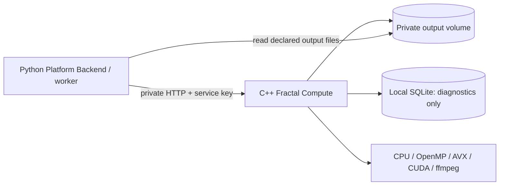
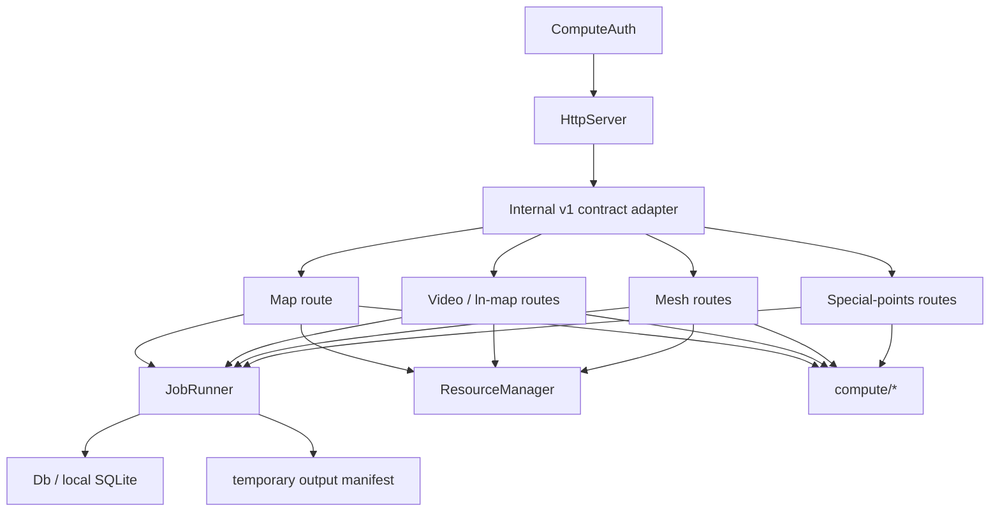
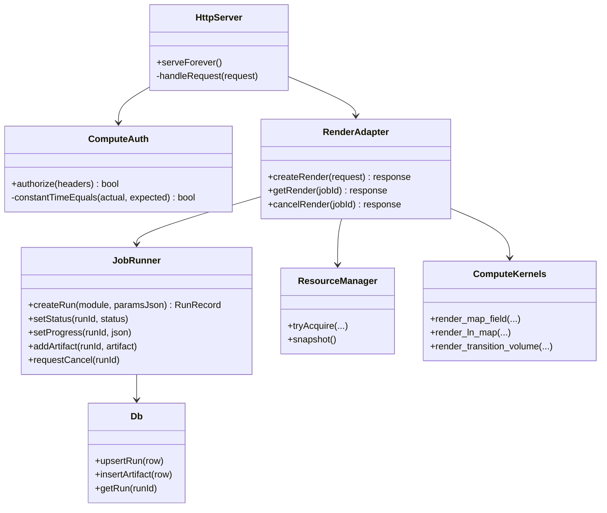
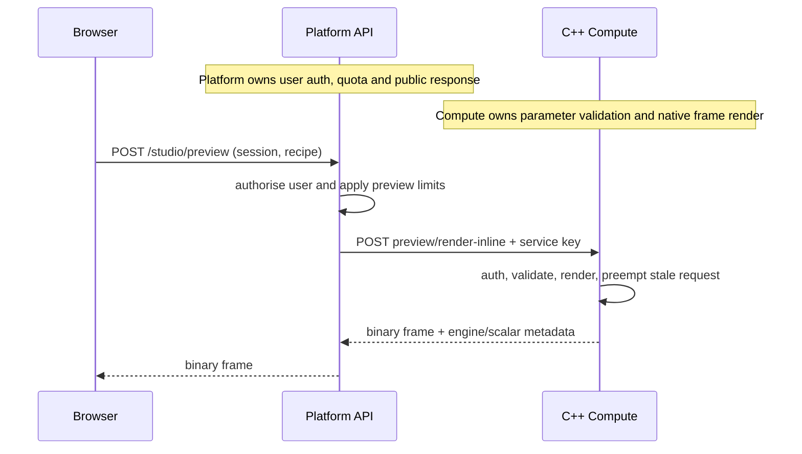
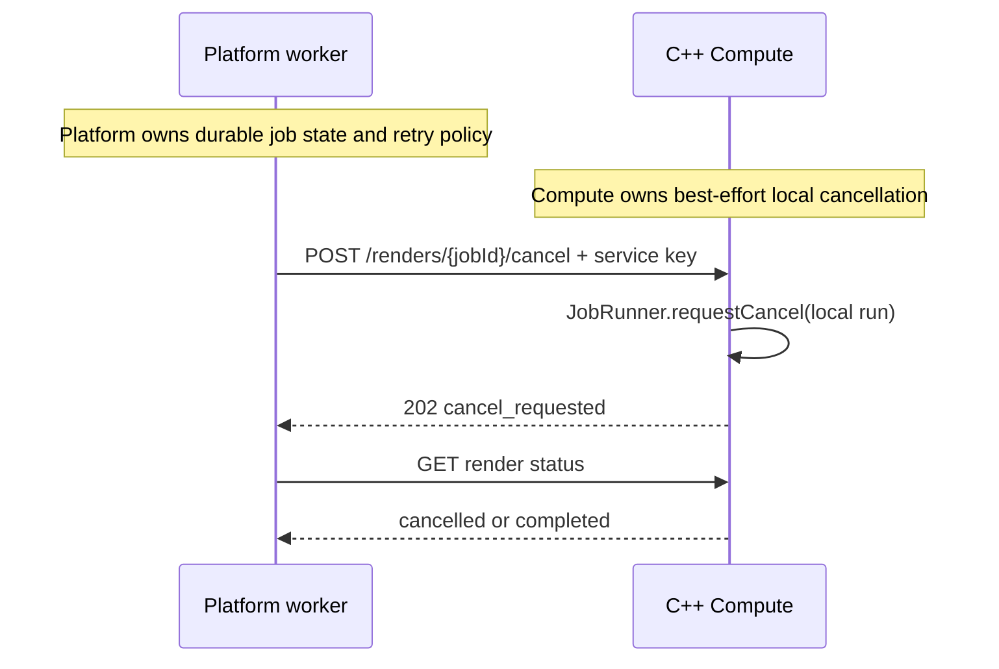

# Fractal Compute Service Specification

## Purpose

`fractal-compute` is a private native C++ service. It deterministically renders
fractal images, videos, and meshes from a recipe. It is not a marketplace API.

It does not know users, assets, listings, orders, payments, S3 object keys, or
browser sessions. Python Platform Backend owns all of those concerns.

## Scope

| Capability | Current source | Compute responsibility |
|---|---|---|
| 2D image | `api/routes_map.cpp`, `compute/map_kernel*`, `colorize*` | render inline preview or PNG master |
| ln-map/video | `api/routes_ln.cpp`, `api/routes_video.cpp` | render zoom/transition MP4 and intermediate frames |
| 3D | `api/routes_mesh.cpp`, `compute/marching_cubes*`, `transition_volume*` | render GLB/STL/voxel artifacts |
| special points | `api/routes_points.cpp` | optional scientific calculation; not marketplace core |
| hardware | `core/hardware_probe.cpp`, adapters | expose private capabilities/health |

## Non-goals

- No public browser endpoint in MVP.
- No user authentication or marketplace CRUD.
- No Stripe, S3 SDK, or PostgreSQL marketplace tables.
- No hosted runtime formula compilation. `variants/compile` remains local trusted-dev
  functionality only and must be disabled in hosted mode.

## Deployment Architecture



- Compute port is exposed to Platform container network only, never public ingress.
- `runtime/runs` is a private temporary volume shared with the Platform render worker.
- Local SQLite may retain run diagnostics during migration. Platform database is source of
  truth for durable job, asset, and retry state.

## Module Architecture



## Core Classes



## Internal API Contract

All routes except private healthcheck require:

```http
X-Compute-Service-Key: <COMPUTE_SERVICE_KEY>
```

Key lives in container secret/environment, never frontend and never git. C++ compares it
in constant time. Network isolation is mandatory; key is a second boundary, not a firewall.

| Method | Path | Behaviour |
|---|---|---|
| `GET` | `/internal/v1/health` | private liveness/readiness |
| `GET` | `/internal/v1/capabilities` | hardware and supported compute paths |
| `POST` | `/internal/v1/preview/render-inline` | bounded binary preview; no artifact/output file |
| `POST` | `/internal/v1/renders` | create image/video/mesh job; return `202` |
| `GET` | `/internal/v1/renders/{jobId}` | status, progress, result manifest |
| `POST` | `/internal/v1/renders/{jobId}/cancel` | request cancellation |

### Create request

```json
{
  "jobId": "platform UUID",
  "kind": "image",
  "idempotencyKey": "platform UUID",
  "recipe": {
    "schemaVersion": 1,
    "centerRe": -0.75,
    "centerIm": 0,
    "scale": 3,
    "width": 1920,
    "height": 1080,
    "iterations": 2048,
    "variant": "mandelbrot",
    "colorMap": "inferno"
  }
}
```

Rules:

- `jobId` is Platform-generated and maps to a local `runId`.
- Same `jobId` and canonical request returns existing status/result.
- Same `jobId` with different request returns `409`.
- Compute independently validates dimensions, iterations, frame count, duration, and
  supported engines. Platform validation is not trusted security input.

### Result manifest

```json
{
  "jobId": "platform UUID",
  "status": "completed",
  "result": {
    "engine": "openmp",
    "scalar": "fp64",
    "generatedMs": 812,
    "files": [{
      "name": "master.png",
      "kind": "image",
      "mediaType": "image/png",
      "sizeBytes": 1843321,
      "sha256": "..."
    }]
  }
}
```

File names are relative to the run directory. Compute never returns `localPath`,
`outputDir`, unfiltered ffmpeg stderr, or filesystem browsing endpoints to Platform users.

## Main Sequences

### Inline preview



### Durable export

```mermaid
sequenceDiagram
  participant W as Platform render worker
  participant C as C++ Compute
  participant V as Private output volume
  Note over W: Platform worker owns job orchestration and ingestion
  Note over C: Compute owns run lifecycle and native render
  Note over V: Temporary files are private worker-to-compute transport
  W->>C: POST /internal/v1/renders + service key
  C->>C: create local run; acquire ResourceManager lease
  C->>C: render image/video/mesh
  C->>V: write files and manifest
  W->>C: GET /internal/v1/renders/{jobId}
  C-->>W: completed result manifest
  W->>V: verify declared SHA-256 and ingest files
```

### Cancellation



## Output And Lifecycle

```text
queued -> running -> completed
                  -> failed
                  -> cancelled
```

- Output goes under configured `FSD_OUTPUT_ROOT/<local-run-id>/`.
- Platform worker reads only files declared by manifest, checks SHA-256, then uploads.
- Cleanup removes successful temporary output after configurable TTL.
- Failed/cancelled output has shorter TTL for diagnostics.
- Current `runtime/runs` scan and `/api/artifacts/*` are local compatibility endpoints;
  they are not part of hosted production ingress.

## Required Changes Before Hosted Use

1. Add `ComputeAuth`; require key before route dispatch.
2. Bind private network only; remove wildcard CORS in hosted mode.
3. Add internal adapter and stable external `jobId` mapping.
4. Add durable manifest/checksum generation and output-root configuration.
5. Disable custom formula compile/delete and public artifact download routes.
6. Limit HTTP body size and all expensive render parameters.
7. Keep `ResourceManager` as local protection; Platform queue controls cross-worker load.
8. Replace Linux-only assumptions in `dev.sh`/CMake for macOS deployment workflow.

## Acceptance Criteria

- Browser cannot address Compute or obtain its service key.
- Existing PNG, MP4, and mesh compute tests still pass.
- One Platform job maps to one idempotent Compute run.
- Platform can ingest verified image/video/mesh files without a C++ S3 dependency.
- Compute restart cannot create marketplace ownership ambiguity; Platform decides retry.
