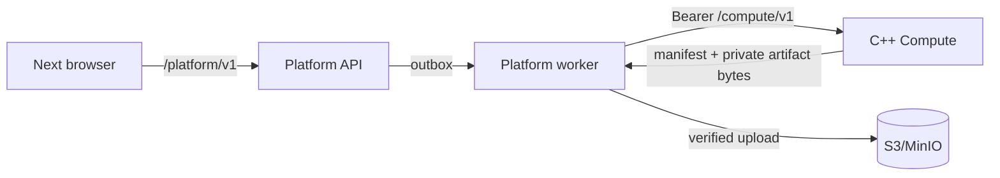

# Fractal Compute Service Specification

## Boundary

`fractal-compute` is private native C++ rendering service. It renders image, video
and mesh artifacts. It never knows browser sessions, users, assets, listings,
orders, payment data or S3 object keys.


```mermaid
flowchart LR
  B[Next browser] -->|/platform/v1| P[Platform API]
  P -->|outbox| W[Platform worker]
  W -->|Bearer /compute/v1| C[C++ Compute]
  C -->|manifest + private artifact bytes| W
  W -->|verified upload| S[(S3/MinIO)]
```

- Browser never calls Compute and never receives `FSD_COMPUTE_SERVICE_KEY`.
- Platform worker is the only Compute client.
- Worker accepts only artifacts in completed manifest, verifies SHA-256 and size
  while streaming, then uploads to object storage.
- Compute local SQLite/runtime files are diagnostics and temporary output only.
  Platform PostgreSQL is durable job/asset source of truth.

## Authentication and network

- `GET /compute/v1/health` is unauthenticated private-network liveness.
- Every other `/compute/v1/*` route requires
  `Authorization: Bearer <FSD_COMPUTE_SERVICE_KEY>`.
- Compute must not be public ingress. Docker host port exists only for local
  development and contract gates.
- Legacy `/api/*` is migration-only, disabled with `FSD_ENABLE_LEGACY_API=0` in
  hosted/dev Platform stack. It is not a Platform or browser transport.

## Private v1 contract

Authoritative machine-readable contract: `compute-openapi.yaml`.

| Platform operation | Route | Result |
|---|---|---|
| liveness | `GET /compute/v1/health` | service/version status |
| capabilities | `GET /compute/v1/capabilities` | authenticated renderer capability set |
| bounded image preview | `POST /compute/v1/previews` | RGBA8 bytes and `X-FSD-Width`, `X-FSD-Height`, `X-FSD-Pixel-Format=rgba8` |
| create durable run | `POST /compute/v1/runs` | `202 { schemaVersion, data.computeRunId }` |
| poll | `GET /compute/v1/runs/{computeRunId}` | status/progress/artifact summaries |
| cancel | `POST /compute/v1/runs/{computeRunId}/cancel` | cancellation intent accepted |
| manifest | `GET /compute/v1/runs/{computeRunId}/manifest` | authoritative completed artifact hashes/types/sizes |
| artifact bytes | `GET /compute/v1/artifacts?artifactId=...` | authenticated binary, optional single range |

Requests use envelope:

```json
{
  "schemaVersion": 1,
  "kind": "map_image",
  "idempotencyKey": "platform-job:<render-job-uuid>",
  "payload": {}
}
```

`idempotencyKey` is required only for durable `/runs`; same kind and payload
returns same Compute run, different payload returns `409 IDEMPOTENCY_CONFLICT`.

Current Platform output mapping:

| Platform output | Compute kind | Contract limit |
|---|---|---|
| preview/image PNG | `map_image` | width/height `64..4096` from Platform; Compute max 8192 |
| MP4 video | `zoom_video` | width/height `128..1920×1080`, duration ≤30s, fps ≤60 |
| HS mesh | `hs_mesh` | resolution `8..1024`, selected GLB or STL |
| transition mesh | `transition_mesh` | resolution `8..1024`, selected GLB or STL |

`canonicalSpec.colorMap` must be mapped into 2D Compute payload. The selected
master media type is enforced by Platform worker, not trusted from a C++ URL.

## Error contract

All v1 JSON failures use:

```json
{"error":{"code":"MACHINE_CODE","message":"safe message","details":{}}}
```

Expected caller handling: `400` invalid request, `401` service key, `404` run or
artifact absent, `409` idempotency/state conflict, `422` unsupported capability,
`429` rate limit, `5xx` temporary Compute failure. Worker maps provider failures
to safe Platform `502 compute_error`; raw payloads never reach browser.

## Verification

- Unit mapper tests prove Platform envelope/version/field mapping.
- `scripts/compute-production-contract.sh` runs black-box Compute v1 contract
  checks with legacy routes disabled.
- `scripts/e2e-real-compute.sh` runs Platform render/ingestion against real C++.
- Release E2E uses stubs for payment and fast worker state; it is not proof of
  C++ compatibility. Real gate covers preview and every Platform output kind.
