# Platform Backend Specification

## Purpose

`platform-backend` is a Python service that owns all public product and
marketplace state. It is the only backend addressed by web frontend. It controls
private C++ Compute jobs but does not implement fractal mathematics.

Recommended stack: FastAPI, PostgreSQL, Redis for quota/rate-limit cache, S3-compatible object
storage (MinIO locally), Alipay web payment and manual creator settlement in Merchant Portal.
An approved Alipay transfer product is post-MVP.

## Stack Map

| Technology | Responsibility | Used in MVP |
|---|---|---|
| Python 3.12 | Application runtime and worker process. | All M1-M7 code. |
| FastAPI + Uvicorn | Serves HTTP routes, cookies and the Alipay webhook. It contains no business state. | `router.py`, `main.py`. |
| Pydantic v2 | Validates request DTOs and serializes response DTOs. | Browser API and Compute/Alipay payloads. |
| PostgreSQL | Durable source of truth and transaction boundary. | Users, sessions, recipes, jobs, assets, listings, orders, entitlements, ledger and outbox. |
| SQLAlchemy 2 async + `asyncpg` | Executes repository queries and commits business transaction with its outbox event. | M1-M7 repositories. |
| Alembic | Versions PostgreSQL schema changes. | `app/migrations/`. |
| Redis + `redis.asyncio` | Atomic quota and rate-limit counters only. Never queues render jobs or stores product state. | M1 access limits and M2 preview/render quota. |
| PostgreSQL outbox + `asyncio` worker | Reliably claims `outbox_events` with leases and runs long work after request commits. | MVP M2 render/cancel and M3 preview generation. |
| `httpx.AsyncClient` | Private typed HTTP calls to C++ Compute and outbound calls to Alipay. | M2/M7 Compute client and M5 Alipay gateway. |
| `cryptography` | RSA2 signing of Alipay requests and verification of Alipay notifications. | M5 only in MVP. |
| S3 API + `boto3` | Stores masters and preview derivatives, issues short-lived download URLs. | M3 only. MinIO implements same API locally. |
| Pillow + system `ffmpeg` | Produces image thumbnail/watermark and video poster/preview. | M3 media operation in outbox worker. |
| Python `logging` + JSON formatter | Emits one structured, request-correlated log line. | API, worker and every M1-M7 module. |
| Docker Compose | Starts API, worker, PostgreSQL, Redis and MinIO together in development. | Local environment only. |
| pytest + HTTPX test client | Unit tests plus API integration tests against Docker services. | `tests/unit`, `tests/integration`, `tests/e2e`. |

## Scope

| Domain | Platform responsibility |
|---|---|
| Identity | registration, login, sessions, roles, creator profile |
| Studio | recipes, quotas, preview authorisation, render jobs |
| Library | private assets, ingestion, metadata, derivatives |
| Marketplace | listings, discovery, favourites and licences |
| Commerce | checkout, webhooks, orders and entitlements |
| Integration | Compute client, workers, S3, Alipay, audit and observability |

## Actors And Use Cases

| Actor | Use case | Outcome |
|---|---|---|
| Guest | explore catalogue | public listing and preview data |
| User | account, checkout, download and creator actions | authenticated account/session, entitlement and creator-gated actions |
| User with creator role | submit/cancel one manual payout request | CNY balance reserved against private Alipay QR image |
| User with `finance_operator` role | review request, manually transfer funds and record result | controlled manual creator settlement |
| Outbox worker | submit/poll/cancel Compute run, derive media and reconcile payment | durable asynchronous state transition |
| Alipay | collect payment and send transaction notification | idempotent commerce transition |

## Use-Case Diagram

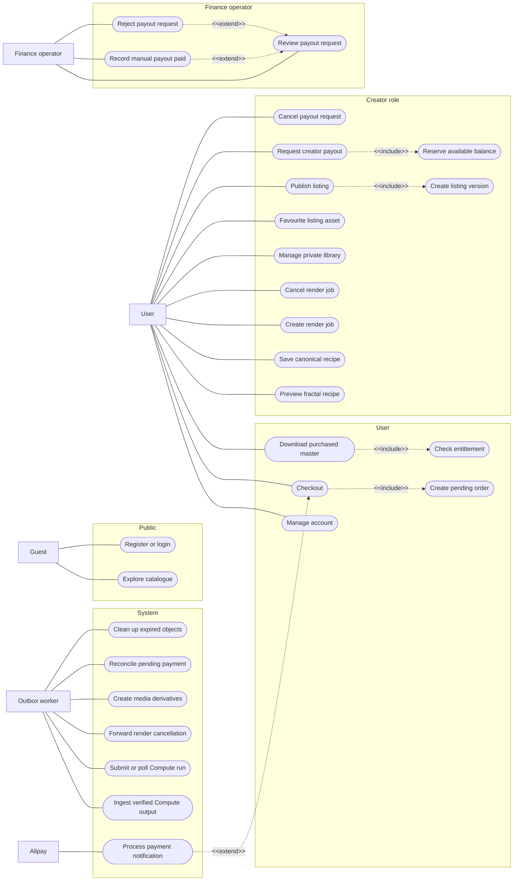
## Runtime Architecture

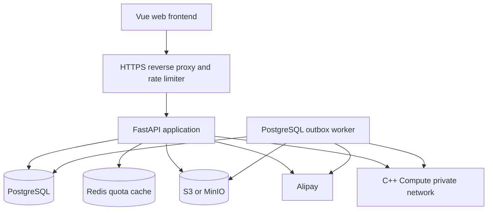

Ownership boundary:

```text
Platform API: user auth, CRUD, business state, PostgreSQL outbox, payments, S3 metadata.
Compute: private deterministic render only.
S3: bytes only, no marketplace authorisation.
Alipay: payment collection and signed notification. Creator transfer stays manual in MVP.
```

## Transaction And Consistency Policy

PostgreSQL is the source of truth. Every state transition uses one short database
transaction. External calls to C++ Compute, S3, ffmpeg and Alipay are never made
while holding a database transaction or row lock. Durable calls are driven by a
committed outbox event and reconciled idempotently afterwards. Bounded preview creates no
durable product state; its Redis rate-limit counter is intentionally ephemeral.

| Operation | Atomic PostgreSQL work | Critical rule |
|---|---|---|
| Register, login, logout | user/session mutation and audit event | Hash passwords and session tokens before write; rotate/revoke in the same transaction. |
| Save canonical recipe | `fractal_recipes` insert/reuse, idempotency record and audit event | Canonicalize before hashing; unique `(owner_id, spec_hash)` decides reuse. |
| Create image/video/mesh render | `render_jobs` with immutable `mapping_version`, PostgreSQL quota reservation and `render.created.v1` outbox event | Commit all three together. PostgreSQL is quota authority. Compute is called only after commit. |
| Cancel render | lock cancellable owned job, set `cancel_requested` and append `render.cancel_requested.v1` | CAS makes one terminal state. Cancellation after `compute_succeeded` is rejected: ingest must finish. |
| Ingest Compute artifact | create `assets(status=processing)` first; later commit master `asset_files`, job/asset terminal states, quota release and `media.create_derivatives.v1` | S3 is not transactional. Verified master uploads before final transaction; failed DB commit queues orphan cleanup. |
| Publish listing | draft validation, immutable `listing_versions` insert, listing transition and audit event | Lock draft listing. A published version and its licence offer cannot be changed. |
| Start checkout | immutable order/item snapshot, payment attempt, delayed `payment.reconcile.v1` event and idempotency response | Lock/read the published listing version; never accept price or amount from browser. |
| Alipay notification or reconcile | lock payment attempt, record notification fingerprint when present, settle or reverse immutable order, entitlement and ledger records | Verify RSA2 and merchant/order/amount. Duplicate notification is no-op. Reversal appends compensating entries and revokes entitlement by licence policy. |
| Create manual payout request | upload QR to unguessable staging object; then lock balance, reserve amount and create `payout_requests` row | DB references QR only after upload succeeds. Failed transaction leaves an orphan-cleanup event. One open request per creator. |
| Mark manual payout paid or rejected | lock request and creator balance, consume reserved amount or release it, append audit event | `finance_operator` records external transfer reference only after human confirmation in Alipay Merchant Portal. |
| Outbox claim | lease due event, increment attempt count, persist retry schedule | Use `FOR UPDATE SKIP LOCKED`; delivery is at least once, so handlers must lock their aggregate and be idempotent. |

Additional rules:

- Idempotency response is marked complete only after the business transaction commits. A failed
  transaction must release or mark the idempotency record retryable; never cache a failure as success.
- Money is `NUMERIC(18,2)`/`Decimal`; validate currency and scale before any write, comparison,
  ledger calculation or Alipay request.
- Use `READ COMMITTED` by default plus explicit row locks for state machines. Do not raise global
  isolation level; retry only serialization/deadlock errors with a bounded policy.
- Redis is only preview rate limiting. Its write is outside PostgreSQL transaction; rate-limit
  failure is fail-closed, while durable render quota is always checked in PostgreSQL.
- Outbox payloads contain immutable IDs/specifications only. They never contain raw session tokens,
  passwords, merchant keys or unredacted Alipay payloads.

## Logging And Request Correlation Policy

Every HTTP request receives a new UUIDv7 `request_id` in `AccessMiddleware` (or accepts a valid
trusted edge `X-Request-ID`) and returns it in the response header. The same value is attached to
audit metadata and copied into outbox payload as `causation_request_id`, so API and worker logs can
be searched as one trace.

Human-readable console log format, in this exact field order:

```text
timestamp_utc | request_id | idempotency_key | user_id | level | message
2026-07-23 14:05:12.347 UTC | 019... | 9f1... | 4f8... | INFO | render job queued
```

Rules:

- `timestamp_utc` is RFC 3339-compatible, human-readable UTC with milliseconds.
- `request_id` is mandatory for HTTP logs; worker-only logs use the triggering
  `causation_request_id` or `-` for scheduled cleanup.
- `idempotency_key` and `user_id` are `-` when absent. Never put them only inside free text.
- `level` is one of `DEBUG`, `INFO`, `WARNING`, `ERROR`. `message` is stable, short and contains
  no secrets, passwords, raw cookies, signed URLs, S3 keys, payout QR images, payment form fields
  or raw Alipay notification.
- Emit the same fields as structured JSON in production; the pipe format is the local readable
  renderer, not a second logging system.

## Module Diagrams

Read these top-down. M0 is a map only. M1-M7 independently expand one module
until controller, service, repository, adapter, entity, and concrete code folder
are explicit enough to start implementation. Arrows mean "uses", not ownership.

### M0. Platform Backend High-Level Module Map

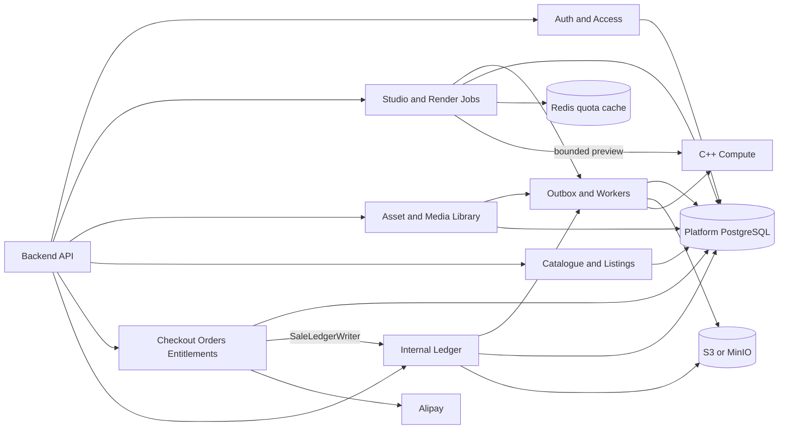

| M0 module | Use cases | Detail diagram |
|---|---|---|
| Auth and Access | register, login, account, roles | M1 |
| Studio and Render Jobs | preview, recipe, image/video/mesh render, cancel | M2 |
| Asset and Media Library | private library, ingest, hide, download | M3 |
| Catalogue and Listings | explore, favourite, publish and licence | M4 |
| Checkout Orders Entitlements | checkout, webhook, fulfilment | M5 |
| Internal Ledger | sale ledger, creator balance and manual payout request | M6 |
| Outbox and Workers | render, media, payment reconciliation, cleanup | M7 |

### M1-M7 Implementation Dependency Graph

Arrows mean "complete this prerequisite first". M7 starts as a small shared
infrastructure task: transactional outbox table, claim/lease repository and worker
shell. Its module-specific handlers are completed together with the module that
owns their business operation.

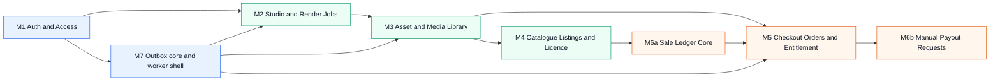

Implementation order: **M1 → M7 core → M2 → M3 → M4 → M6a → M5 → M6b**.
M6a defines journal/schema/writer before checkout settlement; M6b adds manual payout requests.

### M1. Auth And Access Module

Use cases: user registration, login/logout, creator settings, idempotent public
mutations and internal `finance_operator` access for manual payout settlement. OAuth,
password reset and generic admin UI are post-MVP and deliberately have no MVP route or service.

#### Session Mechanism

Use opaque server-side sessions, not browser JWT. After a successful password login,
`SessionService` generates a cryptographically random session ID,
stores only its SHA-256 hash in `sessions`, and sends the raw value as a cookie:

```text
Set-Cookie: fs_session=<random>; HttpOnly; Secure; SameSite=Lax; Path=/; Max-Age=2592000
```

Request path:

```text
Browser cookie
  -> AccessMiddleware extracts fs_session
  -> hashes token and finds active session
  -> checks expiry, user status and roles
  -> attaches current_user to request context
  -> router calls application service
```

Rules:

- Cookie is `HttpOnly`; JavaScript cannot read it.
- Cookie is `Secure`; production uses HTTPS only.
- `SameSite=Lax` blocks normal cross-site mutation posts. For any cross-site flow,
  require a CSRF token and validate `Origin`.
- Store session ID hash, `user_id`, expiry, creation IP/user-agent fingerprint, and
  revoked timestamp. Never store raw session token in PostgreSQL or logs.
- Rotate session ID after login, role change and sensitive action.
- Logout revokes current session. Account-recovery/session-revoke-all flow is post-MVP.
- Access middleware reads current user roles from DB or short Redis cache. Role
  removal takes effect without waiting for token expiry.

#### Why Not Browser JWT

JWT is useful for short-lived service-to-service claims, but adds no value for this
first-party web frontend. A signed JWT remains valid until expiry after logout or
privileged-role removal unless a deny-list is added.
That deny-list recreates server-side session state anyway. JWT refresh-token flows,
rotation, and claim invalidation add implementation and security complexity.

Opaque sessions give immediate revocation, one simple cookie, current RBAC checks,
and a small `sessions` table. Use JWT or a service key only for private machine
identity, for example Platform worker to C++ Compute; never put Compute credentials
in browser code.

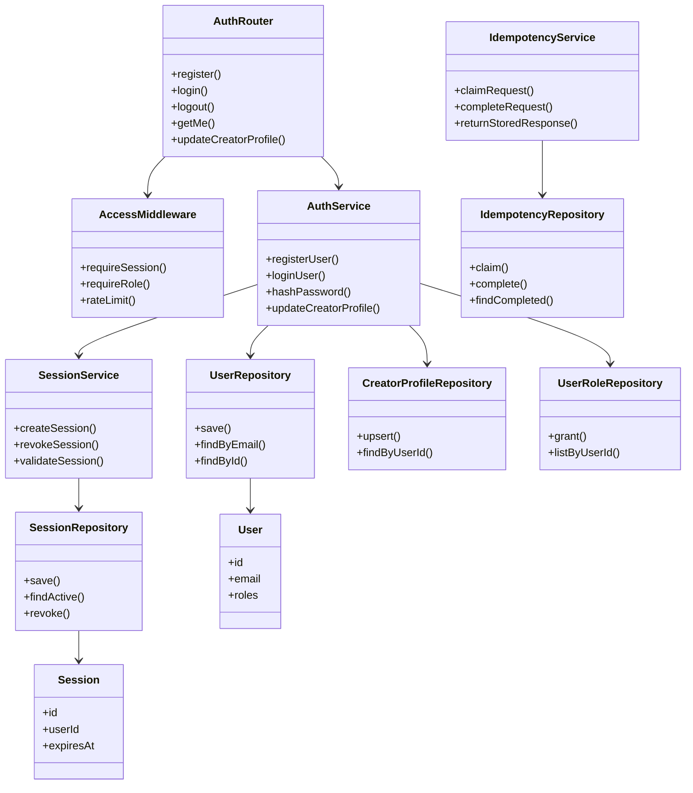

```text
app/auth/router.py
app/core/access_middleware.py
app/core/idempotency_service.py
app/core/idempotency_repository.py
app/core/audit_writer.py
app/core/audit_repository.py
app/auth/service.py
app/auth/session_service.py
app/auth/user_repository.py
app/auth/session_repository.py
app/auth/creator_profile_repository.py
app/auth/user_role_repository.py
app/auth/models.py
```

### M2. Studio And Render Job Module

Use cases: preview a recipe, save an immutable canonical fractal structure, create
an image, video or mesh render, poll progress and cancel a render. Studio is the only
product domain allowed to request fractal compute. `PreviewService` calls C++
synchronously for a bounded frame; `RenderWorker` calls C++ asynchronously for
durable output.

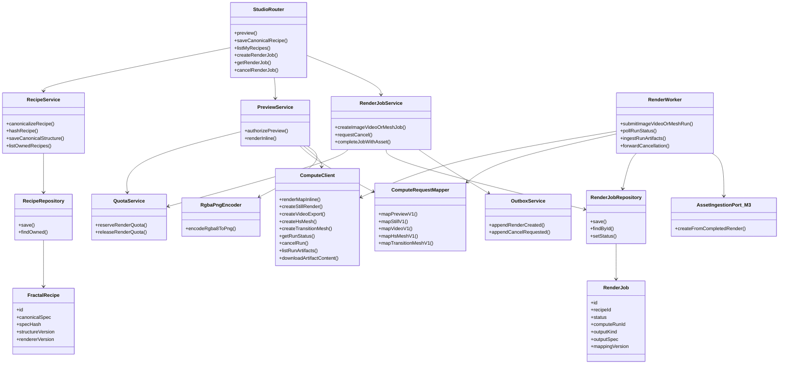

```text
app/studio/router.py
app/studio/recipe_service.py
app/studio/preview_service.py
app/studio/rgba_png_encoder.py
app/studio/render_job_service.py
app/studio/render_worker.py
app/studio/compute_request_mapper.py
app/studio/quota_service.py
app/studio/recipe_repository.py
app/studio/render_job_repository.py
app/studio/models.py
app/infrastructure/compute/compute_client.py
```

#### Responsibilities And Dependencies

| Module | Why it exists / owns | Python dependencies | External dependencies and data |
|---|---|---|---|
| `StudioRouter` | HTTP boundary for preview, canonical-structure save and one image/video/mesh render-job endpoint. Parses DTOs and maps domain errors to HTTP. No business rules. | FastAPI, Pydantic v2, dependency injection | `AccessMiddleware`, `IdempotencyService`, `RecipeService`, `PreviewService`, `RenderJobService` |
| `RecipeService` | Canonicalises immutable fractal-structure JSON, validates supported fields, hashes it, and creates or reuses the owner recipe. It persists the structure, never a rendered binary. | Pydantic v2, `hashlib`, standard `json` or `orjson` | `RecipeRepository`, renderer capability read model |
| `PreviewService` | Enforces cheap preview limits, maps canonical spec through the same versioned mapper, calls Compute synchronously, then returns PNG. Never creates a `render_job`, S3 object or asset. | `httpx.AsyncClient`, Pydantic, FastAPI response types | Redis rate limiter through `QuotaService`, `ComputeRequestMapper.mapPreviewV1()`, `ComputeClient.renderMapInline()`, `RgbaPngEncoder`, C++ `POST /api/map/render-inline` |
| `RgbaPngEncoder` | Converts the real Compute `application/octet-stream` RGBA8 response plus `X-FSD-width`/`X-FSD-height` headers into `image/png`. Keeps browser API stable without changing C++. | Pillow | in-memory frame only; no S3 or database |
| `RenderJobService` | Creates idempotent image, video or mesh jobs from an existing immutable canonical recipe. `output.kind` is `image`, `video`, `hs_mesh` or `transition_mesh`; it persists requested output spec, reserves quota, owns state transition/cancellation request, and does not render inline. | SQLAlchemy 2 async transaction API, Pydantic | `RenderJobRepository`, `QuotaService`, `OutboxService`, PostgreSQL |
| `QuotaService` | Stops one user exhausting CPU/GPU/storage. PostgreSQL reservation is durable authority for renders; Redis is preview rate limit only. | `redis.asyncio`, SQLAlchemy 2 async | PostgreSQL quota/reservation history; Redis atomic rate-limit window |
| `ComputeRequestMapper` | Versioned translation from `canonicalSpec` + `outputSpec` to Compute request DTOs. `mapping_version` is saved in `render_jobs` before first Compute call, so a retry cannot remap an old job. | Pydantic v2 | `docs/compute-openapi.yaml`; no HTTP or DB |
| `ComputeClient` | Typed private HTTP adapter. Sends mapper output, mandatory `clientJobId`, `Authorization: Bearer` service key, timeout/retry policy, and translates response/error DTOs. | `httpx.AsyncClient`, Pydantic v2 | C++ Compute internal DNS URL, `COMPUTE_SERVICE_KEY` secret |
| `RecipeRepository` | Persists and loads only recipe data. Hides SQL from service. | SQLAlchemy 2 ORM/Core, `asyncpg`, Alembic migrations | PostgreSQL `fractal_recipes` table |
| `RenderJobRepository` | Persists job state, external `compute_run_id`, progress and terminal result. Provides poll read model. | SQLAlchemy 2 ORM/Core, `asyncpg`, Alembic migrations | PostgreSQL `render_jobs` table |
| `OutboxService` | Commits `render.created.v1` and `render.cancel_requested.v1` in same DB transaction as job state. Prevents lost background work. | SQLAlchemy 2 async | PostgreSQL `outbox_events`; M7 worker claims rows directly |
| `RenderWorker` | Invokes/polls/cancels C++ Compute. On terminal success it lists artifacts, selects output-spec-allowed IDs, saves those IDs and Compute metadata to `RenderJob.computeResultJson`, then calls M3 `AssetIngestionPort.createFromCompletedRender()`. This is a Platform method, not a C++ route. M7 calls it from a claimed outbox event; it is never HTTP. | `httpx`, SQLAlchemy | `ComputeClient`, `ComputeRequestMapper`, M3 `AssetIngestionPort`, private Compute artifact routes |


Boundary rules:

- `StudioRouter` must not import SQLAlchemy repositories or `httpx` directly.
- `RenderJobService` must not call C++ Compute, S3 or an M3 repository directly; it commits state and
  an outbox event. M7 executes the long-running work.
- `PreviewService` may call Compute directly only for bounded, non-persistent preview.
- M2 must not depend on Alipay, listings, orders, entitlements, or media conversion.
- `FractalRecipe.canonicalSpec` is the persisted canonical fractal structure. It is immutable;
  image/video/mesh outputs are represented by `RenderJob.outputKind` and `RenderJob.outputSpec`.
- C++ actual engine/scalar/output plus selected artifact IDs are recorded later by `RenderWorker`
  in `RenderJob.computeResultJson`. The resulting asset is linked through `Asset.renderJobId`; `RenderJobView.assetId`
  is derived from that relation.

#### Verified Current C++ Compute Contract And Required Production Contract

The methods below are the actual routes in `fractal_studio-master/backend/src/core/http_server.cpp`.
`ComputeClient` is a Platform-side adapter; its method names above are not C++ API paths.

| Platform operation | Verified C++ route | Current result used by Platform |
|---|---|---|
| bounded image preview | `POST /api/map/render-inline` | binary RGBA frame and `X-FSD-*` metadata headers; no run/artifact |
| durable still image | `POST /api/map/render` with `stillExport=true`, `background=true` | `runId`, queued/completed status; PNG artifact is written under the run directory |
| durable video | `POST /api/video/export` | `runId`; background job produces MP4 plus PNG/JSON artifacts |
| durable HS mesh | `POST /api/hs/mesh` | `runId`; background job produces GLB and STL artifacts |
| durable transition mesh | `POST /api/transition/mesh` | `runId`; background job produces GLB and STL artifacts |
| poll a run | `GET /api/runs/status?runId={runId}` | run status, progress and artifact IDs/paths |
| cancel a run | `POST /api/runs/cancel` with `{ runId }` | `status=cancel_requested` |
| enumerate run artifacts | `GET /api/artifacts?runId={runId}` | `artifactId`, kind, size, content/download paths |
| read artifact bytes | `GET /api/artifacts/content?artifactId={runId:fileName}` | binary image/video/mesh/report bytes |

`ComputeRequestMapper` is explicit, versioned and pure. It accepts only validated
`FractalRecipe.canonicalSpec` plus `RenderJob.outputSpecJson`, then produces C++ bodies:

| `output.kind` | mapper method | C++ route | allowed master artifact |
|---|---|---|---|
| `image` | `mapStillV1()` | `/api/map/render` | PNG |
| `video` | `mapVideoV1()` | `/api/video/export` | MP4 |
| `hs_mesh` | `mapHsMeshV1()` | `/api/hs/mesh` | GLB or STL |
| `transition_mesh` | `mapTransitionMeshV1()` | `/api/transition/mesh` | GLB or STL |

Mapper changes create a new `mapping_version`; that value is persisted in `render_jobs` when a job
is created, before M7 can call Compute. Selected artifact IDs are saved later in
`RenderJob.computeResultJson`. A job never re-maps a saved recipe differently while it is running.

Current server source also registers legacy `POST /api/runs/{runId}/cancel`; Platform **must not**
call it. Production contract has exactly one cancel path: `POST /api/runs/cancel`.

Compute auth contract: every private request sends `Authorization: Bearer <service-key>`.
Compute returns `401` for missing/unknown/revoked key and `403` for valid key lacking `render`
scope. Rotation uses key IDs in server configuration with two active hashes: deploy new key to
Platform, verify calls, revoke old key. Browser never receives this key.

Current C++ Compute does **not** expose idempotent submission, a result manifest, SHA-256 checksums,
or service-key authentication. Production implementation is blocked until it implements
[`compute-openapi.yaml`](compute-openapi.yaml): `Authorization: Bearer`, `clientJobId` uniqueness,
standard error body/status enum, request limits and exactly one cancel route. Platform ignores C++
`localPath`, calculates SHA-256 after download, and allowlists extensions/purposes from saved
`RenderJob.outputSpec`.

MVP output rules are strict: `image → png`, `video → mp4`, `hs_mesh/transition_mesh → glb | stl`.
No generic conversion layer exists. A mesh may stay in private library but is not publishable until
it has required PNG listing derivatives.


### M3. Asset And Media Library Module

```mermaid
classDiagram
  class AssetRouter {
    +listMyAssets()
    +getAsset()
    +hideAsset()
    +deleteAsset()
    +createDownloadUrl()
  }
  class AssetService {
    +createProcessingAsset()
    +ingestCompletedRender()
    +listOwnedAssets()
    +hideAsset()
    +deleteAsset()
    +createDownloadUrl()
  }
  class AssetIngestionPort_M3 {
    +createFromCompletedRender(renderJobId, artifactIds)
  }
  class AssetReader_M3 {
    +findOwnedAsset(assetId, ownerId)
    +findPublicPreview(assetId)
    +findPublishableAsset(assetId, ownerId)
  }
  class ComputeArtifactReader {
    +listRunArtifacts()
    +downloadArtifactContent()
    +calculateSha256()
  }
  class MediaWorker {
    +createThumbnail()
    +createWatermarkedPreview()
    +createVideoPoster()
  }
  class ObjectStorage {
    +putObject()
    +createSignedGetUrl()
    +deleteObject()
  }
  class AssetRepository {
    +createFromCompletedRender()
    +findOwnedAsset()
    +findPublicPreview()
    +findById()
    +findByRenderJob()
  }
  class EntitlementReader_M5 {
    +hasActiveEntitlement(userId, assetId)
  }
  class Asset {
    +id
    +ownerId
    +recipeId
    +status
    +visibility
  }
  class AssetFile {
    +id
    +assetId
    +purpose
    +objectKey
    +sha256
  }
  AssetRouter --> AssetService
  AssetService ..|> AssetIngestionPort_M3
  AssetRepository ..|> AssetReader_M3
  AssetService --> AssetRepository
  AssetService --> ComputeArtifactReader
  AssetService --> ObjectStorage
  AssetService --> EntitlementReader_M5
  MediaWorker --> AssetRepository
  MediaWorker --> ObjectStorage
  AssetRepository --> Asset
  AssetRepository --> AssetFile
```

Use cases: ingest completed Compute output, show creator private library, generate
thumbnail/watermark/poster derivatives, and issue a protected master-download URL.
M3 is one `assets` package. It owns `assets`, `asset_files` and S3 object lifecycle.
M5 owns entitlement data; M3 asks it through a narrow read port for a download.

#### Responsibilities And Dependencies

| Module | Why it exists / owns | Python dependencies | External dependencies and data |
|---|---|---|---|
| `AssetRouter` | Thin HTTP boundary for library, hide and download URL endpoints. | FastAPI, Pydantic v2 | `AccessMiddleware`, `AssetService` |
| `AssetService` | One application service for asset metadata, ingest, hide and signed master URL. It implements M2 `AssetIngestionPort`: first creates a `processing` asset, then receives completed job plus selected artifacts, verifies/uploads master and atomically makes asset `ready`. | SQLAlchemy 2 async, `hashlib`, `pathlib`, Pydantic | `AssetRepository`, `ComputeArtifactReader`, `ObjectStorage`, M5 `EntitlementReader`, M7 `OutboxService`, PostgreSQL |
| `ComputeArtifactReader` | Private adapter over the verified Compute artifact routes. It lists `GET /api/artifacts?runId=...`, downloads only selected `GET /api/artifacts/content?artifactId=...` bytes, and calculates SHA-256 itself because current Compute has no artifact manifest/checksums. It may later switch to a read-only shared volume without changing its interface. | `httpx.AsyncClient` or standard I/O, `hashlib`, `pathlib` | C++ Compute artifact list/content endpoints or read-only private output volume; M2 completed run and selected artifact IDs |
| `MediaWorker` | Async follow-up after master ingest. Makes thumbnail, watermarked preview and video poster, then adds derivative `asset_files`. | Pillow, `subprocess` wrapper for ffmpeg | M7 PostgreSQL-outbox worker, worker temp directory, `AssetRepository`, `ObjectStorage` |
| `ObjectStorage` | One S3/MinIO adapter for upload, delete and short-lived signed GET URL. It contains no marketplace rules. | `boto3`, app config | S3/MinIO bucket and encryption config |
| `AssetRepository` | One M3-owned repository for both `assets` and `asset_files`. It provides safe `findOwnedAsset()`/`findPublicPreview()`/`findPublishableAsset()` reads through M3 port. | SQLAlchemy 2 ORM/Core, `asyncpg`, Alembic | PostgreSQL `assets`, `asset_files` tables |
| `EntitlementReader_M5` | Consumer-owned M3 port implemented by M5. Answers only whether a user has an active entitlement for an asset; never exposes M5 tables or order details. | Python `Protocol` | M5 `entitlements` query implementation |

Required asset-file purposes:

```text
master                 original private PNG, MP4, GLB or STL
thumbnail              small public card image
watermarked_preview    public medium-resolution image/video preview
video_poster           static frame for MP4 listing
render_manifest        private Platform-generated provenance JSON: Compute route/run ID, mapper version, selected artifact IDs and calculated SHA-256
```

Object-key policy:

```text
private/masters/{asset_id}/{asset_file_id}/{original_name}
public/previews/{asset_id}/{asset_file_id}/{derivative_name}
private/provenance/{asset_id}/{asset_file_id}/manifest.json
```

Boundary rules:

- M3 never exposes filesystem path, Compute `runId`, raw C++ artifact URL, or S3 key to browser.
- `AssetService.ingest_completed_render()` uses `ComputeArtifactReader` to fetch image/video/mesh
  bytes from the private Render backend by `artifactId`. It never uses Compute `localPath`; it
  rejects malformed `runId:fileName`, `..`, path separators, non-allowlisted extensions and files
  not selected by M2 from the saved output specification.
- `render_manifest` is generated by Platform from `RenderJob.computeResultJson`; it is not claimed
  to be a C++ manifest.
- One ingest path only: first commit an `Asset(status=processing, visibility=private)` row;
  outside transaction verify/download and upload master; then lock asset/job, insert master
  `asset_file`, set asset `ready`, complete job/release quota and append
  `media.create_derivatives.v1`. Failure marks asset/job failed and queues orphan cleanup.
- `ready` means master exists. `visibility` is independent: `private` shows in owner library;
  `hidden` removes it from creator UI. Hide may be restored to `private`.
- Delete is soft creator deletion. Physical master cleanup is forbidden while any `order_item`
  or active entitlement references asset; sold masters remain retained for purchasers.
- Public listing pages read `thumbnail`/`watermarked_preview`; original uses only M3 signed URL.
- A signed URL has short TTL and requires `owner_id == user_id` or M5 `EntitlementReader` approval.
- M3 does not create listings, calculate price, verify Alipay notifications, or grant entitlements.

```text
app/assets/router.py
app/assets/service.py
app/assets/repository.py
app/assets/media_worker.py
app/assets/models.py
app/assets/ports.py
app/infrastructure/compute/compute_artifact_reader.py
app/infrastructure/storage/object_storage.py
```

### M4. Catalogue Listing And Licence Module

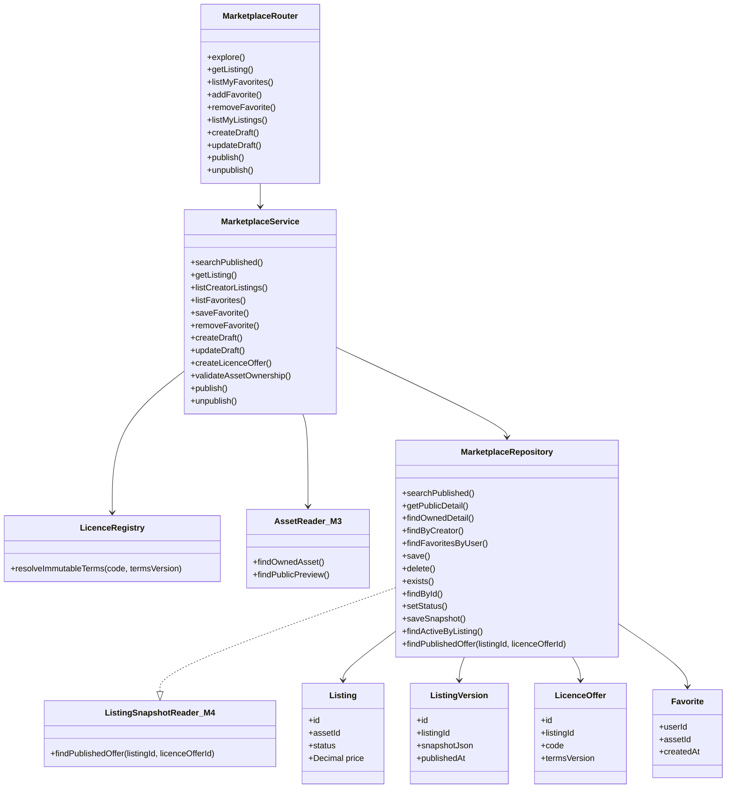

Use cases: explore, favourite, create draft listing, select licence, publish and
unpublish. M4 is one `marketplace` package. Asset ownership/lifecycle remain in M3;
M4 uses a narrow M3 `AssetReader` port, not a repository dependency.

#### Responsibilities And Dependencies

| Module | Why it exists / owns | Python dependencies | External dependencies and data |
|---|---|---|---|
| `MarketplaceRouter` | One HTTP boundary for explore, favourites and creator listing actions. Public reads return only preview metadata; mutations require session, creator ownership and idempotency key. | FastAPI, Pydantic v2 | `AccessMiddleware`, `IdempotencyService`, `MarketplaceService` |
| `MarketplaceService` | One application service for catalogue search, favourites, draft/edit, one active licence offer, publish/unpublish. `publish()` validates all invariants and writes immutable listing snapshot in same transaction. | SQLAlchemy 2 async, Pydantic, `orjson` | `MarketplaceRepository`, M3 `AssetReader`, `LicenceRegistry`, PostgreSQL |
| `MarketplaceRepository` | One repository for catalogue query, favourites, listings, listing versions and licence offers. It owns all M4 SQL and never touches S3, Alipay or C++ Compute. | SQLAlchemy 2 ORM/Core, `asyncpg`, Alembic | PostgreSQL `listings`, `listing_versions`, `licence_offers`, `favorites` tables |
| `ListingSnapshotReader_M4` | Narrow M5-facing port. Returns one purchasable published listing/version/licence snapshot, never mutable draft fields. | Python `Protocol` | M4 marketplace query implementation |
| `AssetReader_M3` | Narrow M3-owned read port, injected into M4. It exposes safe `findOwnedAsset()`, `findPublicPreview()` and `findPublishableAsset()` only; no S3 key, master download, M3 writes or repository internals. | Python `Protocol` | M3 asset query implementation |
| `LicenceRegistry` | Server-owned `(code, termsVersion) -> immutable termsJson` registry. Browser sends only code/version; it never supplies sale terms. | Python module, Pydantic | versioned licence templates/config |

Planned package additions for M4:

```text
fastapi
pydantic>=2
sqlalchemy>=2
asyncpg
alembic
orjson
```

Search strategy for MVP:

```text
PostgreSQL full text search: title, description, creator handle, tags
pg_trgm: typo-tolerant title and creator-handle search
B-tree: status, published_at, price_amount, creator_id
cursor pagination: published_at + id or ranking + id
```

#### MVP Catalogue Feed

`GET /v1/explore` is the single primary catalogue endpoint. It needs no separate
"initial list" route.

- Without query parameters it returns the first 24 published listings ordered by
  `listing.published_at DESC, listing.id DESC` (`sort=newest`).
- The query selects only `ListingView` projection: published listing/version,
  public creator fields, active licence offer and M3 thumbnail/watermarked preview.
  It never selects a master `asset_file.object_key` or creates a signed original URL.
- The response is `{ data: ListingView[], page: { nextCursor } }`. `nextCursor`
  is opaque and encodes `sort`, normalized filters and last sort tuple. Frontend passes it back
  unchanged as `?cursor=...`; a cursor cannot be reused with different filters.
- Optional `q`, `tag`, `creator`, `mediaType`, price and `sort` parameters narrow or reorder the
  same published-only projection. Empty query always stays the fast newest-feed path.
- MVP favourites are explicit user-to-asset bookmarks. They do not affect ranking. MVP has no
  recommendation feed; that can later add a different sort without another public route.

Boundary rules:

- M4 reads only safe asset metadata through M3 `AssetReader`; M4 never reads S3 master objects.
- Draft listing is editable. `ListingVersion` is immutable after publication and is the
  buyer-facing snapshot.
- Money is stored as PostgreSQL `NUMERIC(18,2)` / Python `Decimal`, with `currency=CNY`.
  Float is forbidden. API money fields are decimal strings such as `"19.90"`; this prevents
  binary floating-point loss in JavaScript and Python.
- Creator cannot publish an asset owned by another user or an asset not `ready`.
- `published` transition requires M3 `findPublishableAsset()`: owned `ready` asset, private
  visibility and required thumbnail/watermarked preview (mesh is library-only until it has PNG
  preview), one active licence offer, valid decimal price/currency and immutable snapshot.
- Listing transitions: `draft -> published -> unpublished -> draft`; every publish creates next
  immutable `ListingVersion`, sets `current_published_version_id`; unpublish clears pointer.
- MVP has exactly one active licence offer per listing; partial unique index enforces it. API uses
  singular `licenceOffer`, and `ListingView` exposes singular active offer.
- MVP has at most one non-archived listing per asset (partial unique index). Tags are normalized
  through `listing_tags`; `tags` is bounded input/output on draft and snapshot.
- Paid `OrderItem` refers to a frozen listing/licence snapshot from M5, never mutable draft data.
- M4 does not call Alipay, create orders, grant entitlement, upload media, or call C++ Compute.

```text
app/marketplace/router.py
app/marketplace/service.py
app/marketplace/repository.py
app/marketplace/models.py
app/marketplace/ports.py
```

### M5. Checkout Order And Entitlement Module

Use cases: create Alipay checkout, process payment notification, show order history
and issue protected download. Alipay collects money; Platform is the only authority
for its `Order`, entitlement and ledger transaction.

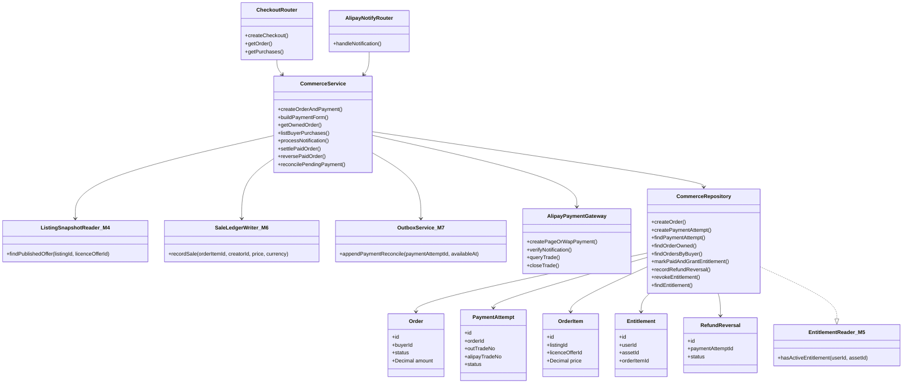

#### Responsibilities And Dependencies

| Module | Owns / does | Dependencies |
|---|---|---|
| `CheckoutRouter` | Authenticated checkout request, order reads and purchase history. Returns a signed Alipay form/redirect descriptor; never reports payment as complete. | FastAPI, Pydantic; `CommerceService`, session and idempotency middleware |
| `AlipayNotifyRouter` | Public `POST` boundary for Alipay `notify_url`. Reads raw form parameters, has no browser session/cookie dependency, returns literal `success` only after durable handling. | FastAPI; `CommerceService` |
| `CommerceService` | Creates immutable `Order`/`OrderItem` snapshot and one unique `PaymentAttempt.out_trade_no`; appends delayed reconciliation; builds PC/mobile web payment; verifies notification; atomically settles once or appends a compensating reversal. | SQLAlchemy transaction, `CommerceRepository`, `AlipayPaymentGateway`, M4 `ListingSnapshotReader`, M6 `SaleLedgerWriter`, M7 `OutboxService` |
| `ListingSnapshotReader_M4` | Consumer-owned M5 read port implemented by M4. `findPublishedOffer(listingId, licenceOfferId)` returns only a purchasable published listing/version/licence snapshot. | Python `Protocol` | M4 marketplace query implementation |
| `SaleLedgerWriter_M6` | Narrow M5 dependency implemented by M6. `recordSale()` appends immutable creator-credit and platform-fee entries in the same payment transaction; it has no payout or Alipay-transfer method. | Python `Protocol`, SQLAlchemy transaction | M6 ledger repository |
| `EntitlementReader_M5` | Consumer-owned M3 read port implemented by M5. `hasActiveEntitlement(userId, assetId)` is the only M5 data M3 may ask for during master download. | Python `Protocol` | M5 entitlement query implementation |
| `AlipayPaymentGateway` | Isolated RSA2 client. Signs `alipay.trade.page.pay` (desktop) or `alipay.trade.wap.pay` (mobile), verifies Alipay notification signature and invokes `alipay.trade.query` / `alipay.trade.close`. | `cryptography`, `httpx`; Alipay gateway, merchant private key, Alipay public key, `app_id`, `seller_id` |
| `CommerceRepository` | All M5 SQL: orders, frozen order items, payment attempts, processed notifications and entitlements. Exposes a small entitlement read method to M3. | SQLAlchemy 2, `asyncpg`, Alembic; PostgreSQL |

Payment flow for the China MVP:

1. Store money as PostgreSQL `NUMERIC(18,2)` and Python `Decimal`; serialize it as a decimal
   string (for example `"19.90"`) in JSON. Pass that same validated two-decimal CNY string to
   Alipay. Do not use float or JavaScript number for money.
2. In one transaction create `Order(status=pending_payment)`, immutable `OrderItem` with frozen
   `commission_policy_version`, `creator_amount` and `platform_fee_amount`,
   `PaymentAttempt(out_trade_no=unique)` and delayed `payment.reconcile.v1` outbox event.
   `out_trade_no` is Alipay's merchant order
   number and must be unique. [PC Website Payment](https://developer.alibaba.com/docs/doc.htm?articleId=105901&docType=1&source=search&treeId=237)
3. For desktop return an auto-submitting form for `alipay.trade.page.pay`; for mobile web
   use `alipay.trade.wap.pay`. The gateway must use RSA2 and pass both `return_url` and
   public HTTPS `notify_url`. [Mobile Website Payment](https://developer.alibaba.com/docs/api.htm?apiId=1056&docType=4)
4. `return_url` only restores the buyer UI. `POST /v1/webhooks/alipay` is authoritative:
   validate RSA2 signature, `app_id`, `seller_id`, `out_trade_no`, `total_amount` and a
   successful Alipay trade status. It has no user session. Alipay retries a notification
   until the handler returns exactly `success`; therefore duplicate delivery is normal.
   [Alipay asynchronous notification rules](https://global.alipay.com/developer/helpcenter/detail?_route=sg&categoryId=67617&knowId=201602452303&sceneCode=AC_DEV)
5. Lock the `PaymentAttempt` row and settle only its first valid successful notification.
   M7 handles committed `payment.reconcile.v1` events and also runs a small periodic sweep for old
   `pending_payment` attempts: `reconcilePendingPayment()` queries Alipay, then settles or closes
   the attempt idempotently. Browser return is never proof of payment.

#### Alipay API Contract Audit

The checkout design matches the official China web-payment contract, with these exact rules:

| Contract item | Required implementation |
|---|---|
| PC checkout | `alipay.trade.page.pay`, `product_code=FAST_INSTANT_TRADE_PAY`, unique `out_trade_no`, `total_amount` in CNY yuan, `subject`, `return_url`, `notify_url`, RSA2 signature. |
| Mobile web checkout | `alipay.trade.wap.pay`, `product_code=QUICK_WAP_WAY`, same unique order/amount/notification rules. |
| Notification | Accept form POST without session; verify RSA2 over all returned fields except `sign`/`sign_type`; require configured `app_id`, `seller_id`, exact `out_trade_no`, exact `total_amount`, non-empty `trade_no`; write literal `success` only after transaction commits. `notify_url` must be a public HTTPS path without query parameters. |
| Success decision | Domestic China contract: settle only `TRADE_SUCCESS` or `TRADE_FINISHED`. `WAIT_BUYER_PAY` reschedules. `TRADE_CLOSED` is closed only for unpaid attempt; a paid order receiving closed/refund reconciliation enters reversal handling, never silently closes. |
| Reconciliation | Call `alipay.trade.query` by `out_trade_no`; never infer payment from browser `return_url`. Close only expired unpaid attempts with `alipay.trade.close`. |
| Manual creator payout | Not an Alipay API call. QR image is private operator evidence. It is intentionally separate from buyer checkout and cannot cause entitlement or ledger settlement. |

`alipay.trade.page.pay` defines unique `out_trade_no`, CNY-yuan `total_amount` and `notify_url`;
`alipay.trade.wap.pay` defines the same order/amount requirements. Alipay notifications are
server-to-server POSTs, have no usable session/cookie and must return exactly `success` after
processing. Query is the documented recovery path for uncertain payment state.

This audit deliberately does **not** claim automatic creator payout support. The current transfer
API is a separately enabled product (`/v3/alipay/fund/trans/uni/transfer`) and requires structured
payee data plus `out_biz_no`; a QR-code image cannot safely satisfy that contract.

Boundary rules:

- Browser never gets a merchant private key, Alipay public key, arbitrary amount, or
  entitlement directly from `return_url`.
- One MVP order has exactly one `PaymentAttempt`; a retry creates a new order after previous
  unpaid order is closed. This avoids two paid attempts competing for one entitlement.
- Store `alipay_trade_no`, notification fingerprint and raw notification encrypted or
  redacted for audit; do not trust a notification merely because it names an existing order.
- M5 creates sale/reversal entries through M6 narrow writer port. No browser refund UI in MVP;
  reconciliation may create backend `RefundReversal`, revoke entitlement and flag a paid-out
  creator balance for finance review.

```text
app/commerce/router.py
app/commerce/service.py
app/commerce/repository.py
app/commerce/models.py
app/commerce/ports.py
app/infrastructure/alipay/payment_gateway.py
```

### M6. MVP Sale Ledger Module (M6a Core)

Use case: record paid sale split, reversal and manual payout reserve/settlement journal. M6 has
no automatic payout recipient or Alipay transfer API. Listing price is never re-read after checkout.

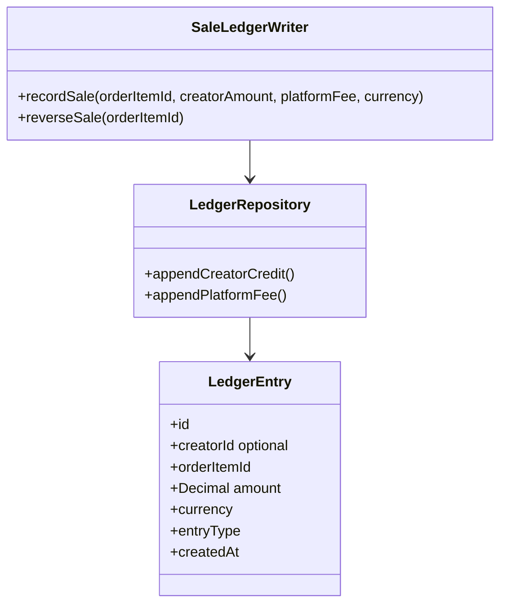

#### Responsibilities And Dependencies

| Module | Owns / does | Dependencies |
|---|---|---|
| `SaleLedgerWriter` | M5 port implementation. During settlement, appends immutable creator-credit and platform-fee entries from frozen split; reversal appends compensating entries and revokes future entitlement by M5 policy. | SQLAlchemy transaction; `LedgerRepository`, M5 frozen order item |
| `LedgerRepository` | Appends/query immutable financial journal. It is source for creator balance projection: sale, reversal, payout reserve, paid and release entries reconstruct available/reserved balance. | SQLAlchemy 2, `asyncpg`, Alembic; PostgreSQL |

MVP rule: staff uses Alipay merchant tools for creator settlement. Journal entry types are
`creator_credit`, `platform_fee`, `creator_reversal`, `platform_reversal`, `payout_reserved`,
`payout_paid`, `payout_released`. `creator_balances` is a cached projection rebuilt from journal;
no `available_at` field exists. Post-MVP may add structured recipient KYC and approved Alipay transfer.

```text
app/finance/sale_ledger_writer.py
app/finance/repository.py
app/finance/models.py
```

#### M6.1 Manual Creator Payout Request

**Chosen MVP path: manual payout.** Creator sends a payout request with CNY amount and
their Alipay QR-code image. A `finance_operator` transfers funds in Alipay Merchant Portal,
then records the external transfer reference. This is cheaper than automatic transfer, needs no
Alipay transfer-product approval and does not attempt to parse a QR image into a payee account.

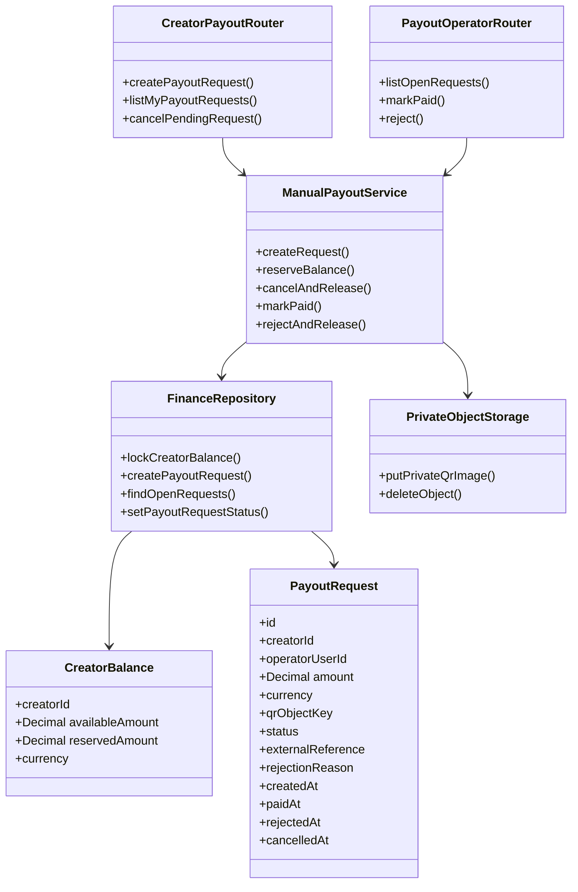

| Part | Responsibility |
|---|---|
| `CreatorPayoutRouter` | Creator-only endpoints. Receives `multipart/form-data`: decimal `amount` and one PNG/JPEG `qrCode`; no public URL is returned. |
| `ManualPayoutService` | Validates `amount > 0`, `currency=CNY`, balance and one-open-request rule; stages QR privately before DB reservation. |
| `PayoutOperatorRouter` | Internal endpoints guarded by `finance_operator`. Operator sees QR through a short private URL, performs transfer manually, then supplies `externalReference` from Merchant Portal. |
| `FinanceRepository` | Owns `creator_balances` and `payout_requests`. Sale ledger writer increments available balance in same payment transaction. |
| `PrivateObjectStorage` | Stores QR image in a private encrypted prefix. It is never listed publicly, embedded in logs, or given to a creator other than its owner/operator. |

Rules:

- Request sequence: stream/validate QR to unguessable private staging object; then transaction
  locks balance, appends `payout_reserved` journal entries and creates `payout_requests(status=pending)`.
  Failed DB transaction queues staging-object cleanup; no row may reference an absent QR.
- Partial unique index allows one `pending` request per creator. This avoids
  concurrent double-withdrawal without a queue or automatic transfer worker.
- Operator `markPaid` appends `payout_paid`; `reject` or creator cancellation appends
  `payout_released`. `creator_balances` projection updates in same transaction.
- `qrObjectKey` is internal storage metadata, never an API response. Accept only image MIME/type,
  maximum 2 MiB, strip metadata and scan before storing.
- QR code is enough for a human to pay in Merchant Portal. It is **not** a stable/verifiable input
  for an automatic Alipay transfer API.
- QR cleanup is owned by `ManualPayoutService`: keep while `pending`; queue private deletion 30 days
  after `rejected`/`cancelled` and 90 days after `paid`. M7 only triggers service cleanup.

Automatic payout is post-MVP. Alipay V3 exposes `POST /v3/alipay/fund/trans/uni/transfer`, but it
requires an enabled transfer product and a structured, verified payee identity—not a QR image—and
must be paired with transfer-status query/idempotent `out_biz_no`. Enable it only after Alipay
contract, KYC, tax and marketplace settlement policy are approved.

```text
app/finance/payout_router.py
app/finance/payout_operator_router.py
app/finance/manual_payout_service.py
app/finance/repository.py
app/infrastructure/storage/object_storage.py
```

### M7. Outbox And Worker Module

Use cases: durable render dispatch, Compute polling/cancel, media derivatives,
payment reconciliation and cleanup. MVP uses one PostgreSQL-backed worker process. No Redis
queue, `arq`, dispatcher or separate worker per use case.

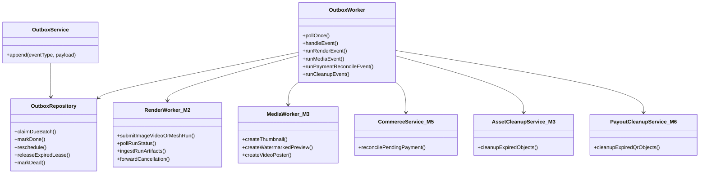

#### Responsibilities And Dependencies

| Module | Owns / does | Dependencies |
|---|---|---|
| `OutboxService` | Transactional event writer used by M2, M3, M5 and M6. It inserts event type, versioned payload, `available_at`, idempotency key and `created_at` in caller transaction. | SQLAlchemy 2; `OutboxRepository`, PostgreSQL |
| `OutboxWorker` | One process that claims due events and invokes operation owned by another module. It contains no render, media, payment or cleanup domain rules. | `asyncio`, SQLAlchemy 2; repositories and M2/M3/M5/M6 service ports |
| `OutboxRepository` | Implements lease/claim/retry/dead-letter state with PostgreSQL `FOR UPDATE SKIP LOCKED`. Tracks `created_at`, `last_error_code`, `last_error_at`, max attempts and dead state. | SQLAlchemy Core, `asyncpg`, Alembic; PostgreSQL |

Event routing reuses existing module methods:

| Event type | Invoked method | Owner |
|---|---|---|
| `render.created.v1` | `RenderWorker.submitImageVideoOrMeshRun()` | M2 |
| `render.poll.v1` | `RenderWorker.pollRunStatus()`, then `ingestRunArtifacts()` on success | M2 |
| `render.cancel_requested.v1` | `RenderWorker.forwardCancellation()` | M2 |
| `media.create_derivatives.v1` | `MediaWorker.createThumbnail()`, `createWatermarkedPreview()`, `createVideoPoster()` | M3 |
| `payment.reconcile.v1` | `CommerceService.reconcilePendingPayment()` | M5 |
| `cleanup.expired.v1` | M3 `AssetCleanupService` and M6 `PayoutCleanupService` | M3/M6 |

Operational rules:

- Producer business transaction and `outbox_events` insert commit together. No request handler
  calls Compute or ffmpeg inline. Checkout uses Alipay form creation inline; reconciliation calls
  Alipay only after event/scheduled sweep commit.
- Worker claims a short lease. Success marks event done. Failure increments attempt count and
  reschedules with exponential backoff. Expired lease becomes claimable again.
- Delivery is **at least once**, never claimed as exactly once. Each invoked M2/M3/M5 method
  must lock its entity and be idempotent by entity state or `out_trade_no`.
- `render.created.v1` submits with `clientJobId=render_job.id`, stores returned `runId`, appends
  exactly one `render.poll.v1`, then completes. `render.poll.v1` keeps same row/key and changes its
  own `status` back to `pending` plus later `available_at` until terminal Compute state. It never
  inserts another poll event, so outbox uniqueness remains valid.
- Long render does not hold a lease while waiting. After `max_attempts`, event becomes `dead` with
  last error data and is visible to operations; it is never silently discarded.
- Start one worker container in `docker-compose.dev.yml`. Scale later by adding identical
  workers; PostgreSQL row locks prevent double claims. Add Redis only when polling load or
  throughput proves PostgreSQL outbox insufficient.

```text
app/outbox/service.py
app/outbox/worker.py
app/outbox/repository.py
app/outbox/models.py
```

### Final Source Layout

Canonical layout is a modular monolith. M0 is a map, not a folder. M1-M7 each own
one package; router, service, repository and models stay together. `core` and
`infrastructure` contain only cross-module concerns. No parallel `application/`,
`interfaces/`, `domain/` or Redis-queue layer.

```text
platform-backend/
  alembic.ini
  pyproject.toml
  uv.lock
  .env.example
  .dockerignore
  Dockerfile
  docker-compose.dev.yml
  scripts/
    dev-migrate-watch.sh
    dev-user.sh
  app/
    main.py
    core/
      config.py
      db.py
      access_middleware.py
      request_context.py
      logging.py
      idempotency_service.py
      idempotency_repository.py
      audit_writer.py
      audit_repository.py
    auth/                         # M1: identity and opaque sessions
      router.py
      service.py
      session_service.py
      user_repository.py
      session_repository.py
      creator_profile_repository.py
      user_role_repository.py
      models.py
    studio/                       # M2: recipes, preview and Compute jobs
      router.py
      recipe_service.py
      preview_service.py
      rgba_png_encoder.py
      compute_request_mapper.py
      render_job_service.py
      render_worker.py
      quota_service.py
      recipe_repository.py
      render_job_repository.py
      models.py
    assets/                       # M3: private master and derivatives
      router.py
      service.py
      repository.py
      media_worker.py
      cleanup_service.py
      ports.py
      licence_registry.py
      models.py
    marketplace/                  # M4: catalogue, listing, licence, favourite
      router.py
      service.py
      repository.py
      ports.py
      models.py
    commerce/                     # M5: order, Alipay checkout, entitlement
      router.py
      service.py
      repository.py
      models.py
      ports.py
    finance/                      # M6: internal immutable sale ledger
      sale_ledger_writer.py
      cleanup_service.py
      payout_router.py
      payout_operator_router.py
      manual_payout_service.py
      repository.py
      models.py
    outbox/                       # M7: durable background execution
      service.py
      worker.py
      repository.py
      models.py
    infrastructure/
      compute/
        compute_client.py
        compute_artifact_reader.py
      storage/
        object_storage.py          # private masters, public previews and payout QR images
      redis/
        quota_store.py
      alipay/
        payment_gateway.py
    migrations/
      env.py
      script.py.mako
      versions/
        20260723_0001_initial_platform_schema.py
  tests/
    conftest.py
    unit/
    integration/
    e2e/
```

## Domain Class Diagram

Only persistent domain data appears here. Routers, services, repositories and
Alipay/Compute adapters remain in M1-M7 module diagrams. `OutboxEvent` has a
polymorphic aggregate reference, so it deliberately has no database foreign key.

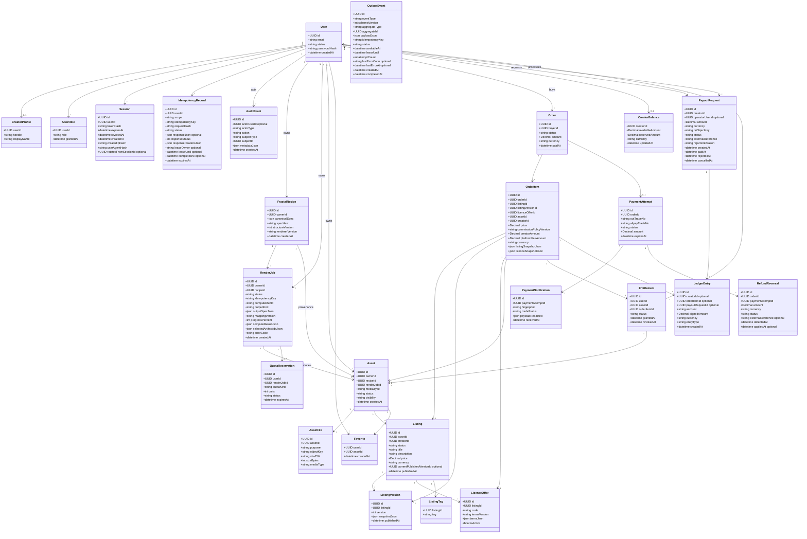

## ER Diagram

Tables are grouped by owner: M1 auth, M2 studio, M3 assets, M4 marketplace,
M5 commerce, M6 finance and M7 outbox. Cross-module reads use IDs/read ports;
they do not merge repositories.

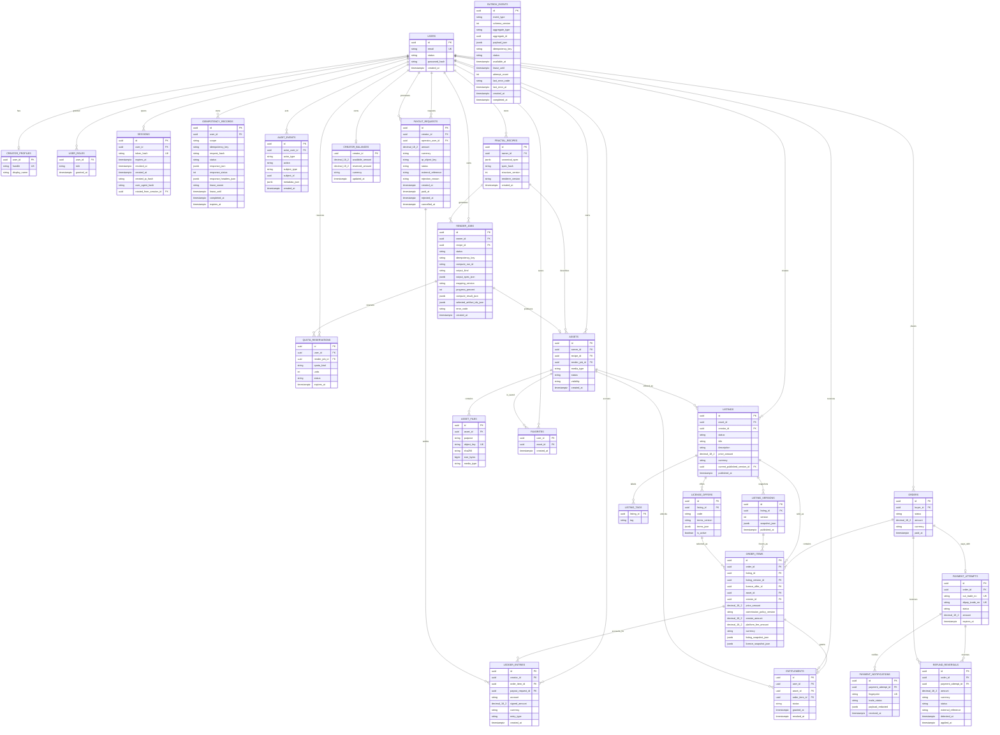

Key constraints outside the visual notation:

- `idempotency_records` is unique by `(user_id, scope, idempotency_key)`;
  `favorites` by `(user_id, asset_id)`; `listing_versions` by `(listing_id, version)`;
  `user_roles` by `(user_id, role)`; `listing_tags` by `(listing_id, tag)`.
- `render_jobs` is unique by `(owner_id, idempotency_key)` and recipes by
  `(owner_id, spec_hash)`. `assets.render_job_id`, `entitlements.order_item_id`,
  `asset_files(asset_id, purpose)`, `out_trade_no` and notification fingerprint are unique.
- `licence_offers` has one active offer per listing; `listings` has one non-archived listing per
  asset. `payment_attempts.order_id` is unique for MVP one-attempt order.
- `audit_events.actor_user_id` is nullable only for `actor_type in (worker, alipay, system)`;
  `payout_requests.operator_user_id` is nullable until operator acts. `ledger_entries.creator_id`
  is nullable for platform account entries.
- `OrderItem` stores both live references for audit and immutable listing/licence JSON
  snapshots for entitlement and finance. A deleted/unpublished listing cannot rewrite a paid item.
- `LedgerEntry` is append-only journal. Sale entries use `order_item_id`; payout entries use
  `payout_request_id`; exactly one source is required. Account/signed amount reconstruct creator
  available/reserved and platform revenue. Settlement checks `creator_amount + platform_fee_amount
  = price_amount` before inserting immutable sale entries.
- `creator_balances` is M6 cached projection updated in same transaction as journal entries.
  `payout_requests` has partial unique index on `creator_id` where status is
  `pending`; `amount` is positive and CNY only. `operator_user_id` and
  `external_reference` are required for `paid`; `operator_user_id` and `rejection_reason` are
  required for `rejected`. QR object keys have no public URL.
- `OUTBOX_EVENTS.aggregate_type/aggregate_id` is intentionally polymorphic. Its payload is
  versioned and contains only IDs/immutable work input, never a browser session or secret.
  Its idempotency uniqueness is `(event_type, aggregate_id, idempotency_key)`, not global:
  one browser mutation may legally create several different event types.

## State Machines And Database Checks

All named state fields use PostgreSQL enum or `CHECK` constraints; services also use row-lock plus
compare-and-set transition. No route mutates a terminal state.

| Entity | Allowed states | Transition / invariant |
|---|---|---|
| `users` | `active`, `disabled` | Disabled user cannot create session or mutation. Capabilities are `user_roles`; creator role is granted with profile creation. |
| `render_jobs` | `queued`, `submitting`, `running`, `compute_succeeded`, `ingesting`, `completed`, `failed`, `cancel_requested`, `cancelled` | `queued→submitting→running→compute_succeeded→ingesting→completed`. `queued/submitting/running→cancel_requested→cancelled`; cancellation after `compute_succeeded` is `409 invalid_state`. |
| `quota_reservations` | `reserved`, `released`, `expired` | PostgreSQL reservation is created with job and released once terminal. |
| `assets` | `processing`, `ready`, `failed`, `deleted` | `processing→ready` only with verified master. Visibility is separate: `private`, `hidden`. |
| `listings` | `draft`, `published`, `unpublished`, `archived` | `draft→published→unpublished→draft`; each publish creates new immutable version/current pointer. |
| `orders` | `pending_payment`, `fulfilled`, `closed`, `payment_exception` | One attempt. Valid success settles to `fulfilled`; unpaid timeout closes. Reversal discrepancy goes `payment_exception` until compensating transaction completes. |
| `payment_attempts` | `created`, `pending`, `succeeded`, `closed`, `failed` | `succeeded` once; duplicate notification no-op. |
| `refund_reversals` | `detected`, `applied`, `manual_review` | Full refund/reversal writes compensating journal entries once. Partial refund or already-paid-out creator balance is `manual_review` in MVP. |
| `entitlements` | `active`, `revoked` | Created once per order item; reversal revokes when licence policy requires. |
| `payout_requests` | `pending`, `paid`, `rejected`, `cancelled` | Pending reserves journal balance; paid consumes reserve; rejected/cancelled releases reserve. |
| `outbox_events` | `pending`, `leased`, `done`, `dead` | Lease expiry returns to pending; max attempts becomes dead with error metadata. |

## Public API

This is the minimal MVP browser API. It follows M1-M6 and the MVP part of M7; old
`GET /assets/{slug}`, `PATCH /recipes/{id}`, generic `GET /assets/{id}`, and
buyer refund-request routes are removed because they conflict with ownership or
immutable data rules.

### Transport Rules

- Browser endpoints use the opaque `fs_session` cookie. Auth is optional only for
  public catalogue routes; a signed-in owner may additionally read their own draft.
- All browser mutations marked **yes** require `Idempotency-Key`. The server stores
  status, response body, HTTP code and replay-safe headers in `idempotency_records` by
  `(user_id, scope, key)`. Multipart payout hash includes normalized fields plus streamed QR SHA-256.
- All JSON successes use `{ "data": T }`; collection successes use
  `{ "data": T[], "page": CursorPage }`. Errors use
  `{ "error": { "code": string, "message": string, "details": object } }`.
- IDs are UUIDs. China MVP money uses `Decimal` / PostgreSQL `NUMERIC(18,2)` with CNY.
  JSON transports money as a decimal string, never a float; Alipay receives the same validated
  two-decimal yuan string. Timestamps are ISO-8601 UTC.
- `AssetView` and `ListingView` never expose S3 keys, Compute IDs, original URLs,
  encrypted payout data, Alipay notification payloads or immutable internal snapshots.

```text
CollectionResponse<T> = { data: T[], page: { nextCursor: string | null } }
DecimalString = string matching ^[0-9]+\.[0-9]{2}$, min 0.01, configured Alipay-safe max
```

`GET /v1/explore` accepts `mediaType=image|video|mesh`, `limit=1..48` (default 24), and
`sort=newest|price_asc|price_desc`. Cursor encodes sort, normalized filters and last tuple:
`(published_at,id)` for newest, `(price_amount,id)` for price. Mismatched cursor/filter is `422`.

Baseline error codes: `401 unauthenticated`, `403 forbidden`, `404 not_found`,
`409 invalid_state`, `409 idempotency_conflict`, `413 payload_too_large`,
`422 validation_error`, `429 quota_exceeded`, `502 compute_error`, `503 payment_unavailable`.

### MVP Technical Limits

| Area | Limit |
|---|---|
| Preview | max `1024×1024`, 1,048,576 pixels, 5 s Compute timeout |
| Image render | max `4096×4096`, 1,000,000 iterations |
| Video render | max `1920×1080`, 30 seconds, 60 fps |
| Mesh render | max resolution `1024`, 1,000,000 iterations |
| Downloaded/uploaded master | max 500 MiB per artifact |
| Listing | title 1–120 chars; description 0–4,000; max 10 tags, each 1–32 |
| Account | password 12–128 chars; handle 3–32 lowercase letters/digits/underscore |
| Alipay subject/price | subject max 128 chars; `0.01 ≤ amount ≤ configured ALIPAY_MAX_TOTAL_AMOUNT` |
| Signed URL | 5 minutes for master; 10 minutes for internal payout QR |

### Request And Response Models

| Model | Fields from Domain/ER exposed or accepted |
|---|---|
| `RegisterInput` | `email`, `password` |
| `LoginInput` | `email`, `password` |
| `UserView` | `id`, `email`, `roles[]`, `status`, `creatorProfile?` |
| `CreatorProfileInput` | `handle`, `displayName` |
| `RecipeInput` | `canonicalSpec` |
| `RecipeView` | `id`, `ownerId`, `canonicalSpec`, `specHash`, `rendererVersion`, `createdAt` |
| `PreviewInput` | `canonicalSpec`, bounded `width`, `height`; Platform always returns PNG |
| `RenderOutputSpec` | strict union: image `{ kind: "image", format: "png", width, height }`; video `{ kind: "video", format: "mp4", width, height, durationSeconds, fps }`; mesh `{ kind: "hs_mesh" or "transition_mesh", format: "glb" or "stl", resolution, meshSpec }` |
| `RenderJobCreateInput` | `recipeId`, `output: RenderOutputSpec`; creates an image, video or mesh job from saved canonical structure |
| `RenderJobView` | `id`, `recipeId`, `status`, `progressPercent`, `assetId?`, `errorCode?`, `createdAt` |
| `AssetView` | `id`, `recipeId`, `mediaType`, `status`, `visibility`, `createdAt`, `files` with `purpose`, `mediaType`, `sizeBytes`, `previewUrl?` |
| `AssetUpdateInput` | `visibility: "hidden" | "private"`; only unlisted asset may be hidden/restored |
| `ListingCreateInput` | `assetId`, `title`, `description`, `tags[]`, `price: DecimalString`, `licenceOffer: { code, termsVersion }` |
| `ListingUpdateInput` | optional `title`, `description`, `tags[]`, `price: DecimalString`, `licenceOffer` while listing is `draft` |
| `ListingView` | `id`, `assetId`, `creator`, `status`, `title`, `description`, `tags[]`, `price: DecimalString`, `currency`, `publishedAt?`, `preview`, active `licenceOffer` |
| `FavoriteView` | `assetId`, `createdAt`, safe preview and optional published listing summary |
| `CheckoutInput` | `listingId`, `licenceOfferId`, `channel: desktop_web or mobile_web` |
| `PaymentStartView` | `order: OrderView`, `paymentAttempt: { id, outTradeNo, status, expiresAt }`, `alipayForm: { action, method: "POST", fields }` |
| `OrderView` | `id`, `status`, `amount: DecimalString`, `currency`, `paidAt?`, immutable items with listing/licence/asset/price and frozen commission split summary |
| `DownloadUrlView` | `url`, `expiresAt` |
| `PayoutRequestCreateInput` | `multipart/form-data`: `amount: DecimalString`, `qrCode: PNG or JPEG`; CNY only |
| `PayoutRequestView` | `id`, `amount: DecimalString`, `currency`, `status`, `createdAt`, `paidAt?`, `rejectionReason?`; QR key and operator reference are never creator-visible |
| `InternalPayoutRequestView` | `id`, creator `{ id, email, handle? }`, `amount`, `currency`, `status`, `createdAt`, short-lived `qrUrl`, `qrExpiresAt`, `operator?`, `externalReference?`, `rejectionReason?`; finance role only |
| `PayoutSettlementInput` | `externalReference`; `finance_operator` only, submitted after manual transfer |
| `PayoutRejectInput` | `reason`; `finance_operator` only |

### M1. Auth And Account

| Method and route | Auth | Idempotency | Input | Success output |
|---|---|---|---|---|
| `POST /v1/auth/register` | public | no | `RegisterInput` | `201 UserView`; creates session cookie |
| `POST /v1/auth/login` | public | no | `LoginInput` | `200 UserView`; rotates and sets session cookie |
| `POST /v1/auth/logout` | user | no | none | `204`; revokes current session and clears cookie |
| `GET /v1/me` | user | no | none | `200 UserView` |
| `PATCH /v1/me/creator-profile` | user | yes | `CreatorProfileInput` | `200 UserView`; transaction upserts profile, grants `creator` role and rotates current session |

### M2. Studio And Render Jobs

| Method and route | Auth | Idempotency | Input | Success output |
|---|---|---|---|---|
| `POST /v1/studio/preview` | user | no | `PreviewInput` | `200 image/png`; Platform converts Compute RGBA8 in memory; no recipe/job/asset persisted |
| `POST /v1/recipes` | user | yes | `RecipeInput` | `201 RecipeView` when created; `200 RecipeView` when same owner canonical hash already exists |
| `GET /v1/me/recipes` | user | no | cursor query | `200 CollectionResponse<RecipeView>` |
| `POST /v1/render-jobs` | user | yes | `RenderJobCreateInput` | `202 RenderJobView`; creates image, video or mesh job and writes M7 `render.created.v1` outbox event |
| `GET /v1/render-jobs/{renderJobId}` | owner | no | none | `200 RenderJobView` |
| `POST /v1/render-jobs/{renderJobId}/cancel` | owner | yes | none | `202 RenderJobView`; writes `render.cancel_requested.v1` |

Recipes have no `PATCH`: `canonicalSpec` is immutable. Create a new recipe instead.

### M3. Private Asset Library

| Method and route | Auth | Idempotency | Input | Success output |
|---|---|---|---|---|
| `GET /v1/me/assets` | user | no | cursor query, optional `status`, `mediaType` | `200 CollectionResponse<AssetView>` |
| `GET /v1/me/assets/{assetId}` | owner | no | none | `200 AssetView` |
| `PATCH /v1/me/assets/{assetId}` | owner | yes | `AssetUpdateInput` | `200 AssetView`; hide/restore unlisted asset |
| `DELETE /v1/me/assets/{assetId}` | owner | yes | none | `204`; soft delete. Sold master is retained, only hidden from creator. |
| `POST /v1/assets/{assetId}/download-url` | owner or entitled user | no | none | `200 DownloadUrlView` |

### M4. Catalogue And Listings

| Method and route | Auth | Idempotency | Input | Success output |
|---|---|---|---|---|
| `GET /v1/explore` | public | no | optional cursor query: `q`, `tag`, `creator`, `mediaType`, `minPrice`, `maxPrice`, `sort`, `limit` | `200 CollectionResponse<ListingView>`; no query returns first published catalogue page, default `sort=newest`, `limit=24` |
| `GET /v1/listings/{listingId}` | public or owner | no | none | `200 ListingView`; draft only for owner |
| `GET /v1/me/favorites` | user | no | cursor query | `200 CollectionResponse<FavoriteView>` |
| `POST /v1/assets/{assetId}/favorite` | user | yes | none | `201 FavoriteView`; creates user bookmark |
| `DELETE /v1/assets/{assetId}/favorite` | user | yes | none | `204` |
| `GET /v1/me/listings` | creator | no | cursor query, optional `status` | `200 CollectionResponse<ListingView>` |
| `POST /v1/listings` | creator | yes | `ListingCreateInput` | `201 ListingView` in `draft` |
| `PATCH /v1/listings/{listingId}` | owner creator | yes | `ListingUpdateInput` | `200 ListingView`; draft only |
| `POST /v1/listings/{listingId}/publish` | owner creator | yes | none | `200 ListingView`; creates immutable listing version |
| `POST /v1/listings/{listingId}/unpublish` | owner creator | yes | none | `200 ListingView` |

### M5. Checkout, Orders And Download Entitlement

| Method and route | Auth | Idempotency | Input | Success output |
|---|---|---|---|---|
| `POST /v1/checkout` | user | yes | `CheckoutInput` | `201 PaymentStartView`; never marks order paid |
| `GET /v1/orders/{orderId}` | order buyer | no | none | `200 OrderView` |
| `GET /v1/me/purchases` | user | no | cursor query | `200 CollectionResponse<OrderView>` |
| `POST /v1/webhooks/alipay` | Alipay only | provider fingerprint | signed Alipay form POST | `200 text/plain` body exactly `success` after durable processing |

`return_url` is browser UX only. It is not an API route that changes order or entitlement state.

### M6. Manual Creator Payout Requests

| Method and route | Auth | Idempotency | Input | Success output |
|---|---|---|---|---|
| `POST /v1/me/payout-requests` | creator | yes | `PayoutRequestCreateInput` | `201 PayoutRequestView`; reserves available CNY balance |
| `GET /v1/me/payout-requests` | creator | no | cursor query | `200 CollectionResponse<PayoutRequestView>` |
| `POST /v1/me/payout-requests/{payoutRequestId}/cancel` | request owner, `pending` only | yes | none | `200 PayoutRequestView`; releases reserved balance |
| `GET /internal/v1/payout-requests` | `finance_operator` | no | cursor query, optional `status` | `200 CollectionResponse<InternalPayoutRequestView>` with short QR URL |
| `POST /internal/v1/payout-requests/{payoutRequestId}/mark-paid` | `finance_operator` | yes | `PayoutSettlementInput` | `200 PayoutRequestView`; consumes reservation after manual Alipay transfer |
| `POST /internal/v1/payout-requests/{payoutRequestId}/reject` | `finance_operator` | yes | `PayoutRejectInput` | `200 PayoutRequestView`; releases reserved balance |

### Deferred After MVP

Account-email changes, public creator pages and refund UI are not browser features in MVP. M6
has a small creator payout-request API, but every transfer is made manually in Alipay Merchant
Portal by `finance_operator`; automatic payout is deferred. M7 has no browser routes.

## Sequence Diagrams

### 1. Render A Private Asset

```mermaid
sequenceDiagram
  participant C as Creator browser
  participant A as Platform API
  participant DB as PostgreSQL
  participant W as Outbox worker
  participant F as C++ Compute
  participant S as S3 or MinIO
  Note over A,DB: M1 authorises, M2 maps recipe and creates job, M7 stores durable work
  Note over W,S: M7 calls M2/M3 owned methods; media derivatives are separate event
  C->>A: POST /v1/render-jobs with recipeId output and Idempotency-Key
  A->>DB: transaction creates queued RenderJob and QuotaReservation
  A->>DB: same transaction appends OutboxEvent render.created.v1 and mappingVersion
  A-->>C: 202 RenderJobView
  W->>DB: claim render.created.v1
  W->>W: map canonicalSpec plus outputSpec with versioned ComputeRequestMapper
  W->>F: create durable run with clientJobId=renderJobId
  F-->>W: runId
  W->>DB: save runId and append one render.poll.v1
  W->>DB: claim/reschedule same render.poll.v1 row
  W->>F: GET /api/runs/status?runId
  F-->>W: completed status and artifact IDs
  W->>DB: save compute result; create Asset processing row
  W->>F: GET /api/artifacts/content?artifactId
  F-->>W: master image or video bytes
  W->>W: allowlist artifact and calculate SHA-256
  W->>S: upload verified master
  W->>DB: M3 transaction adds master AssetFile, marks Asset ready, completes job, releases quota and appends media.create_derivatives.v1
  C->>A: GET /v1/render-jobs/{renderJobId}
  A->>DB: read owner RenderJob and optional Asset
  A-->>C: 200 RenderJobView
```

### 2. Publish A Listing

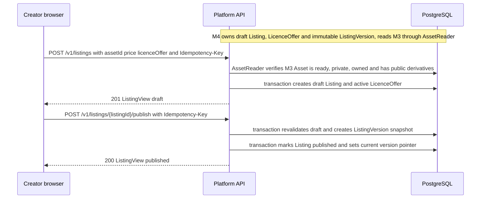

### 3. Checkout And Entitlement

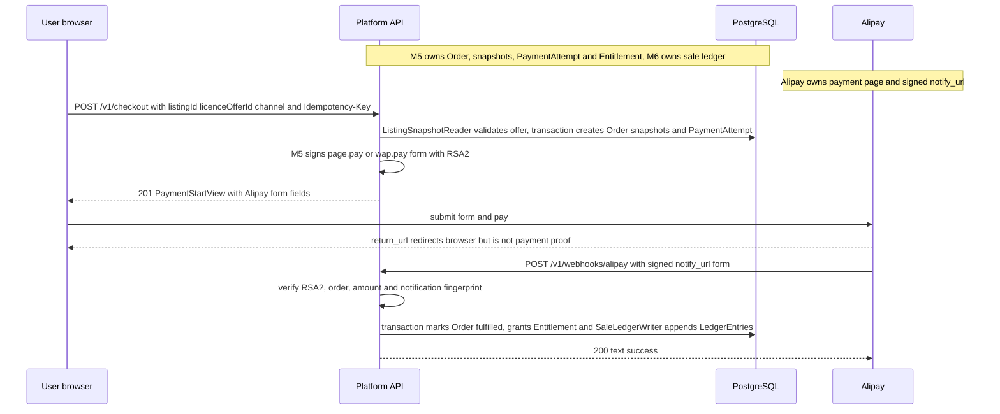

### 4. Protected Download

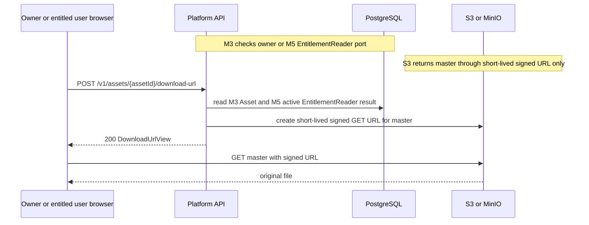

### 5. Cancel Render

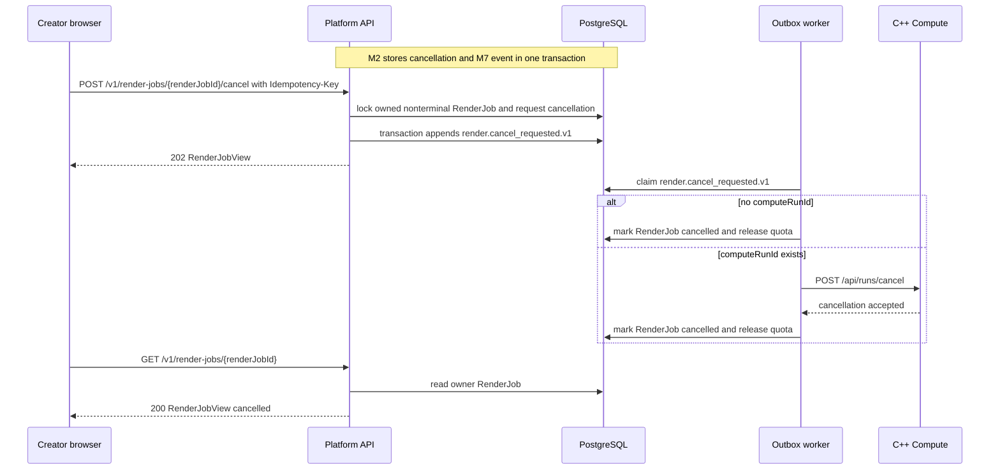

### 6. Reconcile Uncertain Payment

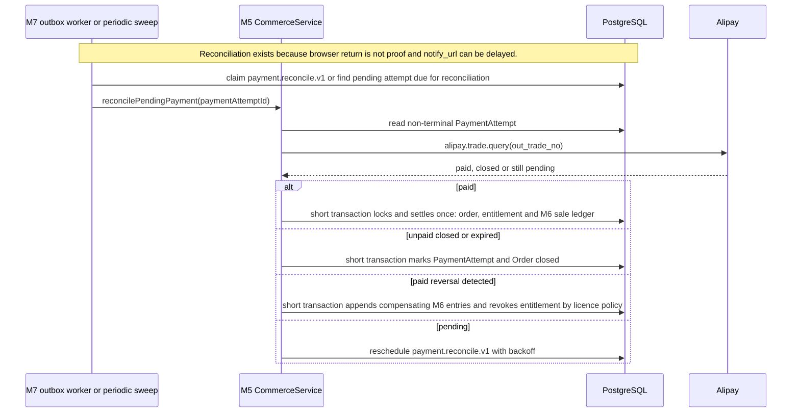
